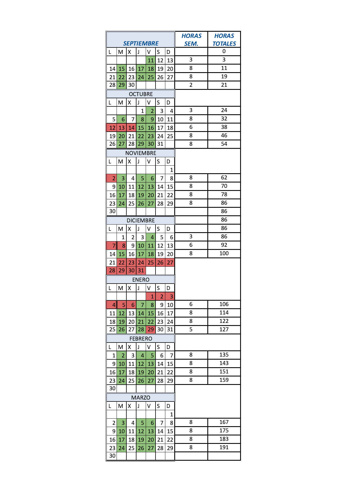
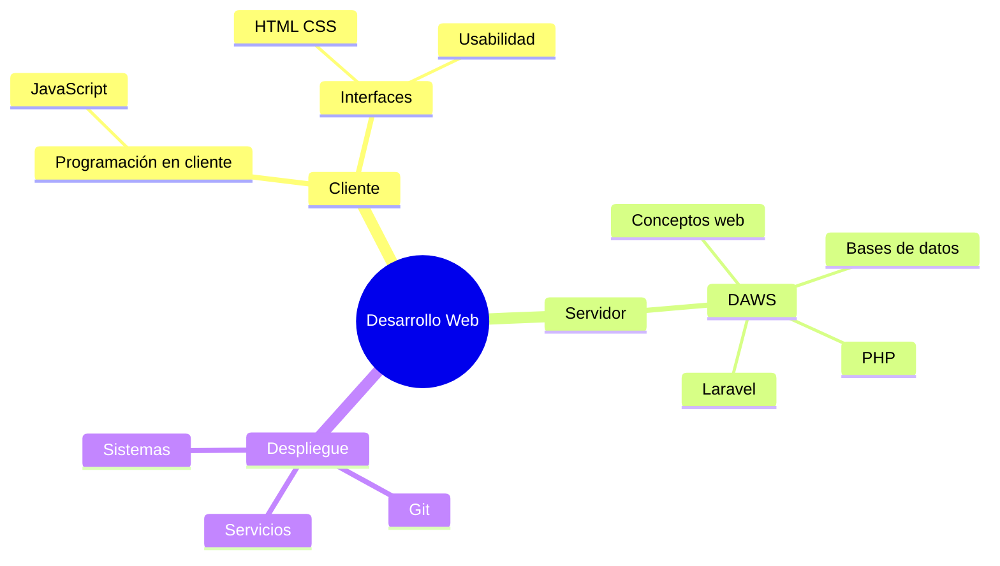

<ButtonSlides href="/slides/presentacion"/>
::: objetivos El módulo DAWS
- Entender el escenario cliente / servidor
- Programar en PHP con criterio
- Montar el entorno con Docker y no perder el trabajo con Git
- Desarrollar aplicaciones profesionales usando Laravel como framework
:::

## Cómo miramos el módulo

- Ver y comprender los principios básicos teóricos
- Adaptarnos a las tecnologías actuales
- Desarrollar la capacidad de **aprender a aprender**
- Desmitificar que una tecnología nueva es “empezar de cero”
- La mejor tecnología es la que resuelve el problema **y** con la que te sientes cómoda

::: pageinfo
Este ciclo consta de diferentes partes muy interrelacionadas
En realidad cada una es parte de un todo
- *(Cliente)* Programación web en el entorno **cliente**: 180 h
- *(Cliente)* Diseño de interfaces Web 180 h
- *(Servidor)* Desarrollar elementos software en el entorno **servidor** (este módulo): 190 h
- *(Sistemas/Servicios/Redes)* Despliege de aplicaciones web: 90 h
:::

::: warning Desarrollar una aplicación web
- Desarrollar una aplicación: **saber programar**
- Una aplicación **web**
- **Desplegarla** en un **servidor**
:::

## Un proyecto común

*Todos con el mismo objetivo*

El planteamiento es que
<Color>somos un grupo trabajando en un proyecto</Color>.

::: warning Recuerda
Todas/os tenemos un mismo objetivo.
:::

::: pageinfo
### Objetivo

**Aprender a aprender**: conocer cómo son las tecnologías de desarrollo web.

**Saber desarrollar una aplicación web**: no se trata solo de manejar un generador de sitios, se trata de programar y formar parte de un desarrollo.
:::

## Horario del curso

## Evaluación y exámenes

### Trabajos y prácticas

Cada bloque tendrá **al menos un trabajo o práctica** de entrega obligatoria.

Los trabajos pueden llevar **nota numérica** o simplemente **apto / no apto**.

La nota final de cada trabajo se calcula así:

1. La nota del trabajo o práctica
2. En el examen de evaluación, **una pregunta sobre ese trabajo**, que pondera de **0 a 1**
3. La nota final de ese trabajo es **el producto de las dos**

::: pageinfo
### Puntos clave

**Nota final por evaluación**

- **0,4** de trabajos + **0,6** de exámenes
- La nota **final del curso** es la media aritmética de cada evaluación
:::

::: pageinfo
### Puntos clave

**Convocatorias**

- Las evaluaciones **aprobadas se pueden guardar** para las convocatorias (1.ª y 2.ª), según proceda
- En la **convocatoria final no hay que presentar trabajos**
:::

Mapa rápido ciclo (no solo de este módulo, es una parte de un todo):

- **Cliente:** HTML/CSS · JavaScript · usabilidad
- **Servidor (DAWS):** conceptos y PHP · bases de datos · Laravel
- **Despliegue:** servicios, Git, sistemas

## Distribución por temas

::: pageinfo Cómo se lee este mapa
No necesariamente se impartirán en este orden. Tampoco tienen la misma duración.
:::

### Bloque introducción

- **Tema 0.** Presentación
- **Tema 0.** Motivación
- **Tema 1.** Conceptos generales del desarrollo web
- **Tema 2.** Arquitecturas y tecnologías web
- **Tema 3.** Docker, Git e IA para el desarrollo web
- **Tema 4.** Instalación del sistema y puesta en marcha

### Programación de aplicaciones en entorno servidor: PHP

- **Tema 5.** Sintaxis del lenguaje y formularios
- **Tema 6.** PHP orientado a objetos
- **Tema 7.** Arrays en PHP
- **Tema 8.** Ficheros: contenidos y gestión de ficheros en el servidor
- **Tema 9.** Autenticación, sesiones y cookies

### Bases de datos y utilidades

- **Tema 10.** Bases de datos con PHP: MySQLi y PDO
- **Tema 11.** Bases de datos NoSQL con PHP: MongoDB

::: warning Segunda evaluación
A partir de aquí, temas de **segunda evaluación**.
:::

### PHP: uso de librerías

- **Tema 12.** Composer como orquestador y autocarga (PSR-4 y classmap)
- **Tema 13.** Servicios web: REST, SOAP y GraphQL

### Laravel

- **Tema 14.** Usando Laravel: instalación y funcionamiento
- **Tema 15.** Rutas, vistas y controladores
- **Tema 16.** Modelo: Eloquent
- **Tema 17.** Desarrollando una aplicación con Laravel
- **Tema 18.** Alrededor de la aplicación (lo justo para no ir a ciegas)
  - Tests
  - Inertia
  - Filament
  - APIs y servicios web
  - Sentry

## Contacto

> **Manuel Romero Miguel**
> manuelromeromiguel@gmail.com
> Profesor del módulo de servidor

