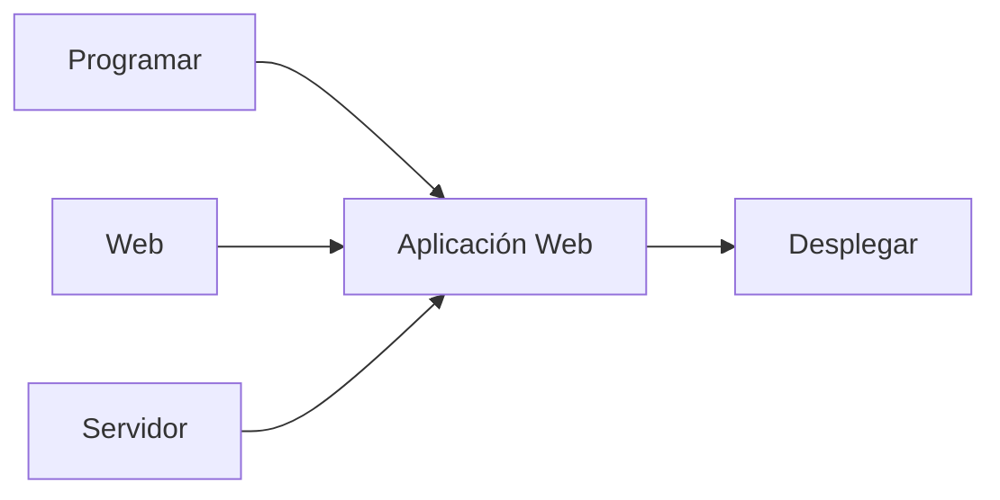
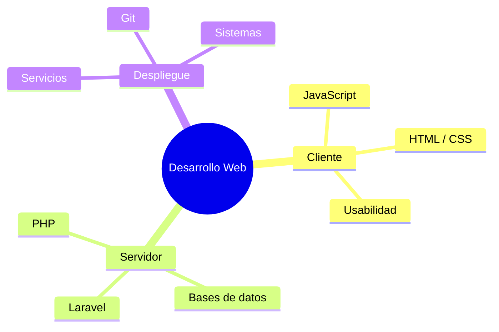
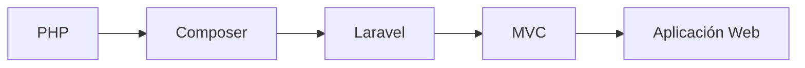

# Desarrollo Web en Entorno Servidor

## DWES

PHP · Docker · Git · Laravel

Manuel Romero Miguel

---

# ¿Qué vamos a aprender?

- 🌐 Entender el escenario **cliente / servidor**
- 🐘 Programar en **PHP**
- 🐳 Trabajar con **Docker**
- 🌿 No perder el trabajo con **Git**
- 🔺 Desarrollar aplicaciones con **Laravel**

::: warning Desarrollar una aplicación web
- Desarrollar una aplicación: **saber programar**
- Una aplicación **web**
- **Desplegarla** en un **servidor**
:::

---
# ¿Qué vamos a aprender?

- 🌐 Entender el escenario **cliente / servidor**
- 🐘 Programar en **PHP** <!-- v-click -->
- 🐳 Trabajar con **Docker** <!-- v-click -->
- 🌿 No perder el trabajo con **Git** <!-- v-click -->
- 🔺 Desarrollar aplicaciones con **Laravel** <!-- v-click -->

---

# No se trata de aprender tecnologías

## Se trata de aprender a aprender

Las tecnologías cambian.

Los conceptos permanecen.

> Una tecnología nueva no significa empezar de cero.

---

# Una aplicación web es...

No basta con **saber programar**.

---

# Somos parte de un todo

---

# Nuestro módulo

## Servidor · 190 horas

Nos centraremos en:

- Conceptos Web
- PHP
- Bases de datos
- Servicios Web
- Laravel

---

# Un proyecto común

## Todos tenemos el mismo objetivo

Trabajaremos como un equipo que desarrolla software.

- Código
- Git
- Entornos
- Prácticas
- Aplicaciones

> Aprender haciendo y entendiendo lo que hacemos.

---

# Evaluación

## 40 % trabajos + 60 % exámenes

Cada bloque tendrá al menos:

- un trabajo o práctica obligatoria
- una pregunta en el examen relacionada con el trabajo

---

# Nota de los trabajos

La calificación combina:

**Nota del trabajo × pregunta del examen**

La pregunta del examen pondera entre:

## 0 → 1

La idea es comprobar que entendemos lo que hemos desarrollado.

---

# Primera parte

### Fundamentos

- Desarrollo Web
- Redes e Internet
- WWW
- Entorno servidor

### Herramientas

- Linux
- Apache
- Docker
- Git

---

# PHP

Aprenderemos progresivamente:

- Sintaxis
- Control de flujo
- Funciones
- Arrays
- Formularios
- Orientación a objetos
- Ficheros
- Sesiones y cookies
- Bases de datos

---

# Y después...

## Laravel

- Rutas
- Vistas
- Controladores
- Eloquent
- Aplicaciones completas

---

# Alrededor de Laravel

Veremos también lo suficiente para no ir a ciegas:

- Tests
- Inertia
- Filament
- APIs
- Sentry

---

# Objetivo final

## Saber desarrollar una aplicación web

No memorizar una tecnología.

No copiar código sin entenderlo.

### Comprender → desarrollar → desplegar

---

# DWES

## Empezamos 🚀

Manuel Romero Miguel