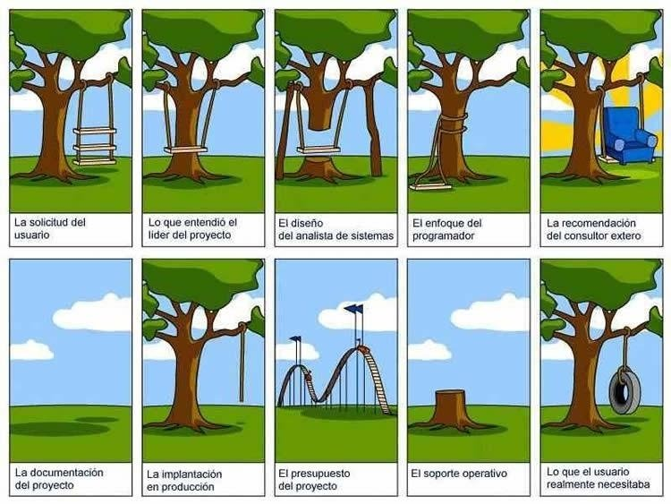
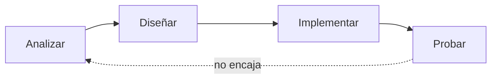
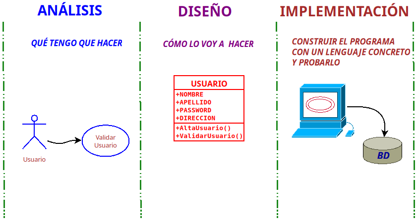
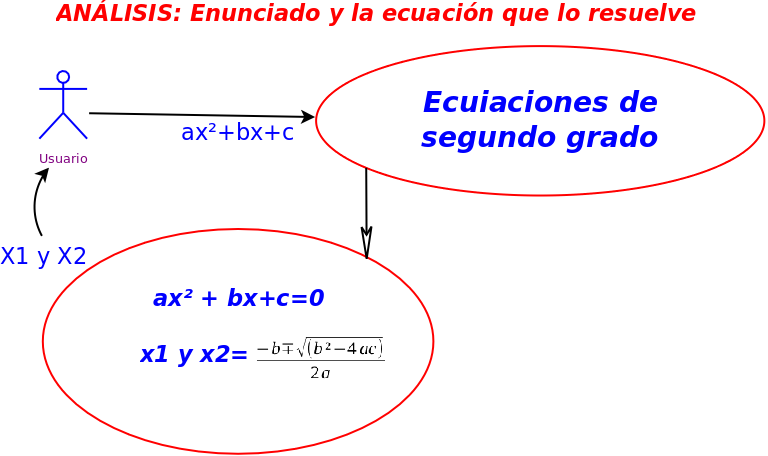
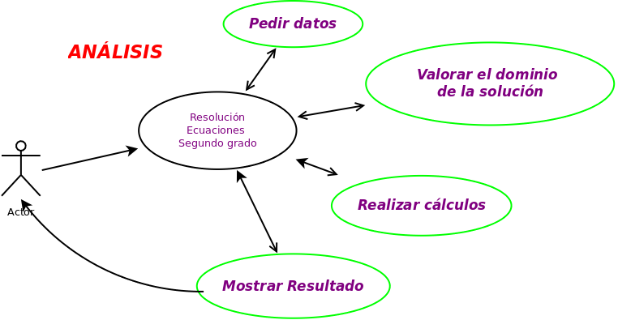
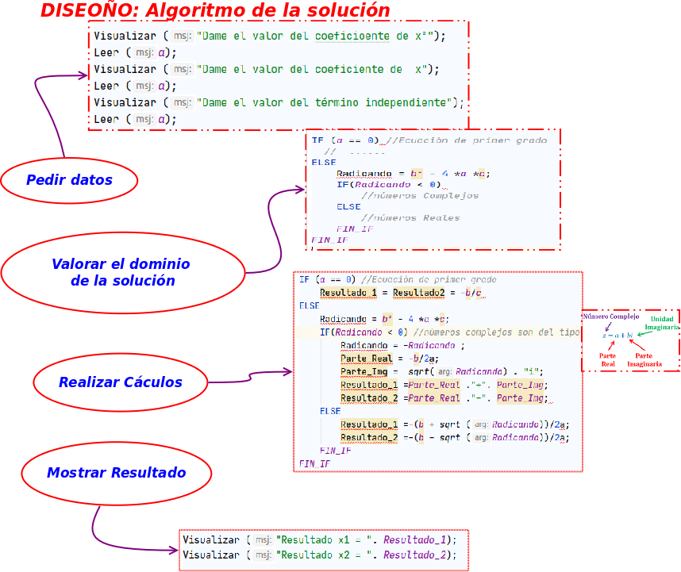
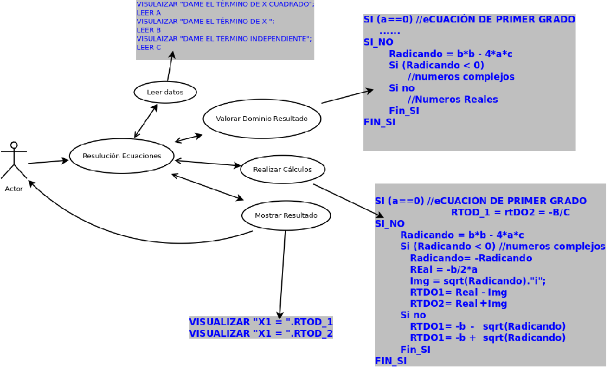

<ButtonSlides href="/slides/02_introduccion"/>

::: objetivos Qué veremos aquí
- Desgranar el nombre del módulo: desarrollar, aplicación web, entorno servidor
- Qué significa **desarrollar** una aplicación (analizar, diseñar, implementar)
- Compilación frente a interpretación, y por qué PHP encaja en la web
:::

::: finalidad Al terminar deberás…
- Dar una definición decente de “desarrollar una aplicación”
- Distinguir analizar / diseñar / implementar con un ejemplo pequeño
- Explicar por qué en este módulo trabajamos con un lenguaje interpretado
:::

El objetivo del módulo lo describe **su propio nombre**.

::: definicion Desarrollo de aplicaciones web en entorno servidor
En esta introducción no programamos todavía: desmontamos esa frase por piezas.
:::

## Partes a analizar

<CardPane>
<Card header="1. Desarrollar" color="#4f46e5">
Analizar, diseñar e implementar un programa que resuelve un problema.
</Card>
<Card header="2. Aplicación web" color="#2496ed">
No es un .exe de escritorio: vive en un navegador que pide y un servidor que responde.
</Card>
<Card header="3. Entorno servidor" color="#4F5B93">
El código que no ve el visitante. PHP y, más adelante, Laravel.
</Card>
</CardPane>

<!-- Fuente: https://es.wikieducator.org/images/d/d4/Dwes_1.png -->

## Desarrollar una aplicación

::: previo Qué es desarrollar una aplicación
Hay muchas respuestas posibles. En clase debería salir al menos una que se pueda defender.
:::

::: actividad Aporta una definición
Intenta decir, en dos o tres frases, **qué es desarrollar una aplicación**. Luego la contrastamos con la de abajo.
:::

### Una definición que nos sirve

Dado un **problema de naturaleza lógica**:

::: definicion Desarrollar una aplicación
- **Implementar** o construir un programa
- usando un **lenguaje de programación**
- formado por un **conjunto de instrucciones**
- que, ejecutadas en un **entorno computacional**,
- **solucionan de forma automatizada** el problema planteado
:::

Para llegar ahí no basta con “ponerse a picar”:

1. Hay que **entender muy bien** lo que queremos hacer
2. Hay que **planificarlo**
3. Hay que **realizar** esa planificación y **probarla**

<!-- Fuente: https://es.wikieducator.org/images/0/08/DesarrolloAplicaciones.jpg -->

*Diseñando y desarrollando: los atajos se pagan más adelante.*

::: pageinfo Entender el problema sigue siendo lo primero
Una IA puede ayudarte a redactar un análisis, a inventar casos de prueba o a traducir un diseño a sintaxis. **No entiende el problema por ti.** Si el enunciado está mal leído, el código —tuyo o generado— también lo estará. En el examen no hay chat
:::

### Qué es implementar

Cuando decimos **implementar** nos referimos a:

1. **Analizar** el problema
2. **Diseñar** una solución algorítmica válida
3. **Escribir el código** de esa solución en uno o varios lenguajes, interpretados o compilados

<!-- Fuente: https://es.wikieducator.org/images/8/89/AnalisisDesignerImplementacion.png -->

::: actividad Ecuaciones de segundo grado
Vamos a recorrer el esquema con una aplicación pequeña: **ecuaciones de segundo grado**.
:::

El planteamiento (el que se expone en clase) es este:

- Se trata de encontrar **dos valores** para que la ecuación se satisfaga (el valor de *x*)
- Se especifica la ecuación que hay que aplicar
- Eso ya es análisis: **entender el problema que el cliente nos transmite**

<!-- Fuente: https://es.wikieducator.org/images/6/6f/E1g.png -->

::: actividad Análisis
Un posible análisis:

<!-- Fuente: https://es.wikieducator.org/images/5/55/E1g_analisis.png -->

:::

::: actividad Un posible diseño
<!-- Fuente: https://es.wikieducator.org/images/0/0f/EcuacionesSegundoGradoDiseno.png -->

:::

::: actividad Implementación
Consiste en **transcribir el diseño** usando un lenguaje concreto, con su sintaxis.

<!-- Fuente: https://es.wikieducator.org/images/7/72/Ecuaciones_grado.png -->

:::

Más adelante eso se hace en PHP. El esquema no cambia: lo que cambia es la sintaxis.

## Compilación o interpretación

::: pregunta Compilación o interpretación
Las instrucciones escritas, de alguna manera, tienen que pasar a código máquina para ejecutarse. Pueden **compilarse** o **interpretarse**. ¿Cuál usamos en la web, y por qué?
:::

::: previo Compilación vs interpretación
Un compilador traduce **antes** a un ejecutable (o a bytecode). Un intérprete traduce **mientras** se ejecuta, instrucción a instrucción —o casi.
:::

::: pregunta Java
¿Java es un lenguaje compilado o interpretado?
:::

Java hace las dos cosas: se **compila** a bytecode y la máquina virtual lo **interpreta** (y a menudo lo acelera con JIT). No es un sí/no limpio; por eso la pregunta sirve para discutir, no para memorizar una etiqueta.

<Quiz
  title="En un entorno de ejecución web, ¿qué tipo de modelo se debe usar?"
  :options="quizWeb"
/>

::: pageinfo Lo que nos interesa en DAWS
PHP es **interpretado**: editas el `.php`, recargas, el servidor lo ejecuta. Hoy PHP 8 además guarda bytecode en **OPcache**, así que no es “lento como en 2005”. Y sí: en internet también hay servidores en Go o Java. **En este módulo el modelo es PHP interpretado** detrás de Apache (en clase, casi siempre dentro de Docker).
:::

## Una aplicación web

::: previo Qué es una aplicación web
En un ordenador solemos ver un programa con el que interactuamos. No todos los programas son del mismo tipo.
:::

Hay software de escritorio, de tiempo real, científico, juegos… y **aplicaciones web**. Los lenguajes de propósito general pueden resolver casi cualquier algoritmo; lo que cambia es **dónde se ejecuta** y **cómo llega el resultado al usuario**.

En una app de escritorio el programa puede **esperar** a que teclees un valor. En la web no: el servidor recibe la solicitud **junto con los datos** (formulario, URL, JSON) y responde. Esa diferencia condiciona todo el módulo.

La continuación —cliente, servidor, URI, `curl`— está en [Aplicación web](/03_conceptos_web/).

| Bloque | Qué es |
| --- | --- |
| Presentación | Horario, exámenes, contacto |
| Motivación | De dónde partimos y cómo vamos a trabajar |
| 1. Introducción | Este tema: qué es desarrollar |
| 2. Auxiliares | Git, Docker, IA, redes, Linux |
| 3. Conceptos web | Cliente/servidor, WWW, qué es PHP |
| 4. PHP | El lenguaje |
| 5. Laravel | Más adelante |

<!--::: pageinfo Primera semana (orientativo)-->
<!--1. Leer la [presentación](/000_Presentacion/) y la [motivación](/000_Motivacion/)-->
<!--2. Montar Git (aunque sea lo mínimo) y el entorno Docker-->
<!--3. Seguir con [aplicación web](/03_conceptos_web/) y [qué es PHP](/03_conceptos_web/php)-->
<!--4. Entrar en [Empezando](/04_php/03_empezando/)-->
<!--:::-->
