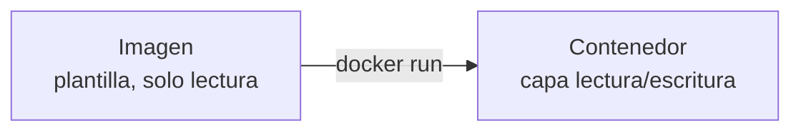
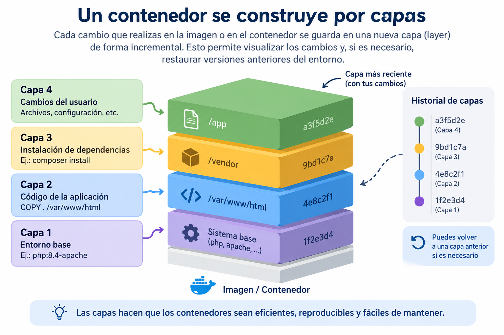
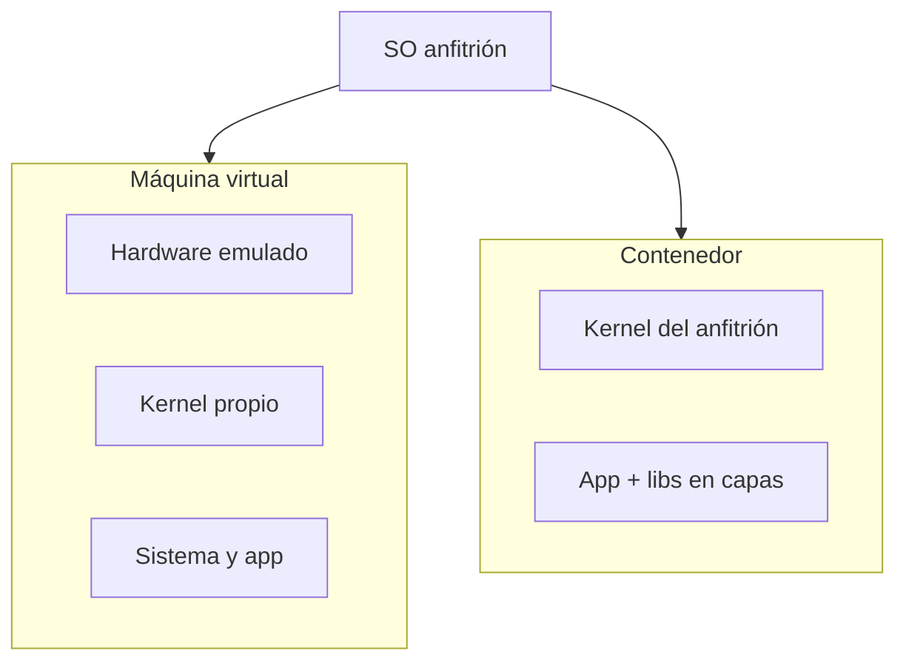
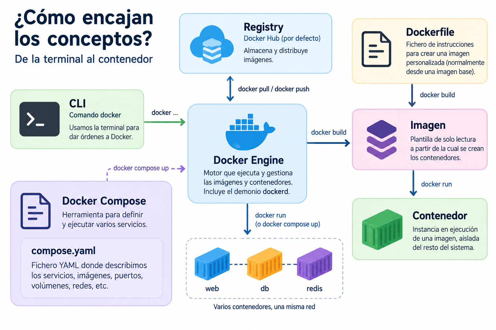

::: objetivos Antes de los comandos
- Distinguir imagen y contenedor
- Entender que el contenedor **no** lleva un sistema operativo completo
- Saber por qué en Windows hace falta WSL
:::

::: definicion Docker | fa-brands fa-docker
Plataforma de virtualización **basada en contenedores**: aísla procesos, sistema de archivos y red. No emula un PC entero.
:::

## La idea

Un <Color>contenedor</Color> es un entorno ejecutable con lo que necesita la aplicación (PHP, Apache, extensiones, config), **aislado** del anfitrión. Así el mismo laboratorio corre en tu portátil, en el del compañero y, más adelante, en un servidor.

 Un <color>contenedor (un archivo ejecutable)</color>  que contiene todo lo necesario para ejecutar una aplicación, incluyendo el código, las dependencias y las configuraciones, de forma totalmente **aislada** del _sistema en el cual se está ejecutando (host)_ . Esto permite que la aplicación se ejecute de manera consistente en cualquier entorno.

* Este archivo contenedor <Color> no incluye un sistema operativo completo propio </Color>, pero funciona como si lo tuviera, <Color > ejecutándose de forma aislada e independiente del sistema anfitrión </Color>.

  > Utiliza el kernel del anfitrión y configura los componentes necesarios para simular el entorno del sistema operativo deseado o requerido, aunque siempre dentro del tipo de sistema operativo del anfitrión.

:::warning Compatibilidad de sistema operativo 

Los contenedores dependen del sistema anfitrión, por lo que los contenedores Linux solo se ejecutan en anfitriones Linux.
 
Sin embargo, gracias a tecnologías comoc  < color > WSL y Hyper-V < /color >, es posible ejecutar contenedores Linux en Windows.

También existen soluciones emergentes para ejecutar contenedores de Windows en Linux, aunque con limitaciones.
:::

### El proceso de empaquetado

En Docker, el proceso de empaquetado agrupa el código fuente y todas las dependencias necesarias para que el software funcione, creando una entidad unificada en forma de archivo de contenedor.

:::definicion Imagen
Para crear un contenedor necesitamos partir de una plantilla base que contenga lo necesario  para este entorno de ejecución aislada. Esta plantilla la conocemos como <Color> imagen </Color>
:::

:::definicion Contenedor
Un <color>contenedor</color> es, en esencia, una instancia ejecutable que virtualiza el software dentro de un entorno específico.
:::

A partir de un contenedor, se pueden crear imágenes en cualquier momento, permitiendo así capturar el estado del entorno y los cambios realizados.

### Creación y actualización de contenedores

A partir de una imagen específica, es posible iniciar un contenedor de forma muy rápida, en cuestión de segundos o menos.

Si realizamos cambios en el contenedor, estos se guardan en capas incrementales, lo que permite visualizar los cambios y restaurar versiones anteriores del entorno, si es necesario.

## Imagen y contenedor

::: definicion Imagen
Plantilla en **capas**: sistema mínimo, librerías, Apache, PHP… A partir de **una** imagen puedes crear **muchos** contenedores.
:::

El **contenedor** es una instancia: una capa de lectura/escritura encima de esa imagen. Ahí ocurren los cambios mientras el proceso está vivo. Si el proceso principal termina, el contenedor pasa a *Exited*.

::: info
No puedes borrar una imagen si aún hay contenedores (aunque estén parados) que la usan. Primero `docker rm`, después `docker rmi`.
:::

## Docker, frente a una máquina virtual

La VM emula hardware y lleva **su propio kernel**. El contenedor comparte el kernel del anfitrión y aísla el resto. Por eso arranca en segundos y pesa menos.

## Conceptos que utilizaremos

| Concepto | Qué es en clase |
| --- | --- |
| **CLI** | La interfaz de línea de comandos. Es el comando `docker` que utilizamos desde la terminal para comunicarnos con Docker. |
| **Docker Engine** | El motor que ejecuta y gestiona los contenedores. Incluye, entre otros componentes, el demonio `dockerd`, que se ejecuta en segundo plano. |
| **Imagen** | Plantilla de solo lectura a partir de la cual se crean los contenedores. |
| **Contenedor** | Instancia ejecutable de una imagen, aislada del resto del sistema. |
| **Registry** | Servicio donde se almacenan y distribuyen imágenes. **Docker Hub** es el registry utilizado por defecto. |
| **Dockerfile** | Fichero de instrucciones que permite construir una imagen personalizada, normalmente partiendo de una imagen base. |
| **Docker Compose** | Herramienta que permite definir y ejecutar entorno para ejecutar aplicaciones. Formadas por varios servicios/contenedores . |
| **`compose.yaml`** | Fichero YAML donde describimos los servicios, imágenes, puertos, volúmenes, redes, etc. que gestionará Docker Compose, y que serán siempre visibles por una red interna. |

<Quiz
  title="¿Por qué un contenedor Linux no arranca, tal cual, en un Windows sin WSL?"
  :options="[
    { text: 'Porque el contenedor lleva un Windows embebido que choca con el anfitrión.', correct: false, why: 'El contenedor Linux no lleva un SO completo. El problema es el kernel que necesita.' },
    { text: 'Porque el contenedor usa el kernel del anfitrión, y un kernel Windows no sirve para un userspace Linux.', correct: true, why: 'El aislamiento es de procesos, no de kernel. Sin WSL2 (o una VM Linux) no hay kernel compatible.' },
    { text: 'Porque Docker solo existe para Ubuntu.', correct: false, why: 'Docker Desktop existe en Windows y macOS; debajo sigue habiendo un Linux.' }
  ]"
/>
