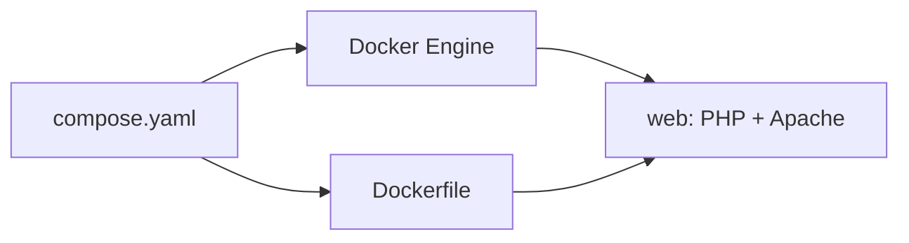
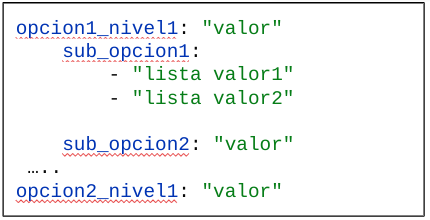
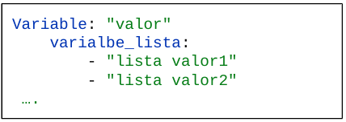
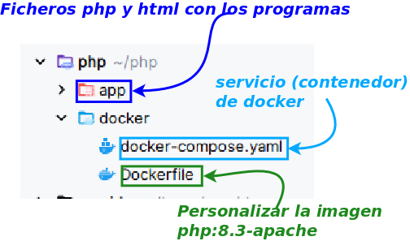

Como desarrolladoras/es web, analicemos la situación en la que nos encontramos ahora:

Cuando desarrolle una aplicación web, es casi seguro que necesitaré tener en el sistema:
> * Un servidor web: p.e apache
>   * Un intérprete de código: p.e php
>   * Un servidor de bases de datos: p.e mysql
>   * Una herramienta para gestionar: p.e phpmyadmin
>   * Otros elementos, como copias de seguridad.


<figure style="text-align: center;">
  
  <figcaption>Estructura de un fichero compose.yaml</figcaption>
</figure>

___

Ante esta situación qué hacemos

<figure style="text-align: center;">
  
  <p><em>Estructura de un fichero compose.yaml</em></p>
</figure>

* Podría tener un contenedor con todos los servicios.
* Pero vaya lío tener todo en un contenedor
* ¿Podría tener un contenedor con cada servicio?
---
---
Para ello disponemos de una utilidad de docker llamada <color>docker compose</color>
::: definicion Docker Compose
Docker Compose es una herramienta que permite definir y levantar varios contenedores de forma conjunta.
Los contenedores se definen en un fichero, <color> compose.yaml</color>, escrito en formato YAML (YAML Ain't Markup Language, «YAML no es un lenguaje de marcado»).
En este fichero definimos principalmente <color>servicios (que son los contenedores) , redes y volúmenes.</color>
Cada servicio describe un tipo de contenedor que queremos ejecutar.
:::

Un `docker run` con cinco flags o parámetros (-t -i --name -p -v ) es más complicado y puede resultar difícil de
recordar. El entorno de ejecución de clase serán **dos ficheros** al lado del código. La creación de la imagen y
levantar los contenedores o servicios: `Dockerfile` y `compose`.



En este comando ha habido una modificación respecto a la versión anterior de docker. El comando actual es el **plugin**
(`docker compose`, con espacio), no `docker-compose`.

### Fichero de configuración

* Es un fichero llamado <color>compose.yaml</color> (también puede utilizarse `compose.yml`).
* <color>YAML</color> o <color>YML</color> es un formato <color>declarativo</color>, cuya configuración y sintaxis es
  muy sencilla.

  YAML viene de **YAML Ain't Markup Language** («YAML no es un lenguaje de marcado»), especificando que no es un
  lenguaje de marcado como XML o HTML:

  > * <color>Tiene en cuenta la indentación para crear bloques.</color>
  > * Asignamos valores utilizando `:` (dos puntos), debiendo haber un espacio entre los dos puntos y el valor.
  > * Para crear listas utiliza guiones `-`.

Es un fichero muy fácil de entender.

<color>Creando el fichero</color>

1. Vamos a ver la construcción del fichero <color>compose.yaml</color>.
2. Posteriormente veremos cómo <color>ejecutar el fichero</color> y construir nuestro <color>entorno de
   desarrollo</color>.

### Sintaxis del fichero

El fichero `compose.yaml` tiene diferentes opciones de configuración que podemos jerarquizar mediante la indentación.

Es un fichero de configuración con formato YAML.





---

### Comando  docker para compose

<CmdPane>
<Cmd name="docker compose up" mne="up" example="docker compose up -d --build">

Levanta el proyecto. `-d` en segundo plano. `--build` reconstruye la imagen si cambió el Dockerfile.

</Cmd>

<Cmd name="docker compose ps" mne="ps" example="docker compose ps">

Estado de **estos** servicios (no de todos los contenedores de tu máquina).

</Cmd>

<Cmd name="docker compose logs" mne="logs" example="docker compose logs -f">

Logs del conjunto. `-f` sigue la salida.

</Cmd>

<Cmd name="docker compose down" mne="down" example="docker compose down">

Para y quita los contenedores del proyecto. Los volúmenes nombrados se quedan, salvo `--volumes`.

</Cmd>
</CmdPane>

YAML: la **indentación** agrupa; espacio después de `:`. Un tab mal puesto tira el fichero.

## Nuestro entorno de ejecución (para desarrollo  web)

Vamos a crear un entorno que puede ser como se comenta en la imagen siguiente


```text
proyecto/
  docker/
    Dockerfile
    compose.yaml
  app/
    index.php
```

```yaml
services:
  web:
    build: ..
    ports:
      - "8800:80"
    volumes:
      - ../app:/var/www/html
    container_name: web
```

- <Color>build: .</Color> usa el `Dockerfile` de esa carpeta
- <Color>8800:80</Color> → `http://localhost:8800`
- <Color>../app:/var/www/html</Color> → editas en PhpStorm, Apache sirve al instante
- <Color>container_name: web</Color> → `docker exec -it web bash`

Desde el directorio del compose:

```bash
docker compose up -d --build
```

## Cuando entre la base de datos

Un solo contenedor con Apache + PHP + MySQL **funciona** y es un lío. Mejor un servicio por proceso. Compose les pone
una red: desde PHP el host de MySQL **no** es `localhost`, es el **nombre del servicio** (`db`).

```yaml
services:
  web:
    build: .
    ports:
      - "8800:80"
    volumes:
      - ../app:/var/www/html
    depends_on:
      - db
  db:
    image: mysql:8.0
    environment:
      MYSQL_ROOT_PASSWORD: root
      MYSQL_DATABASE: ejemplo
      MYSQL_USER: usuario
      MYSQL_PASSWORD: secreto
    volumes:
      - dbdata:/var/lib/mysql

volumes:
  dbdata:
```

Eso llega con persistencia y formularios. El día uno del laboratorio basta el servicio `web`.

::: pageinfo Si “el contenedor no arranca”

1. `docker compose ps` — ¿está `Up` o `Exit`?
2. `docker compose logs -f` — el error suele estar al final
3. Puerto 8800 ocupado: cambia el izquierdo (`8801:80`) o cierra lo que lo usa
4. Permiso denegado al socket: [instalación](../03_instalaciones/index.md) (grupo `docker`)
   :::

