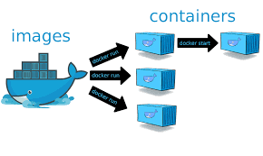
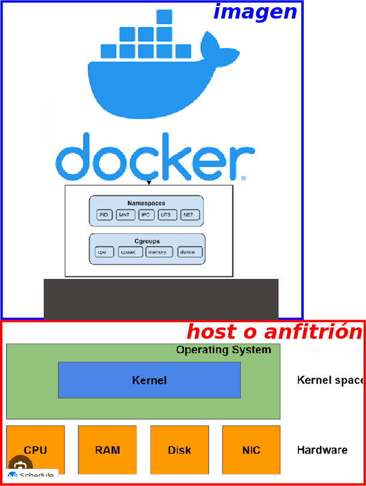
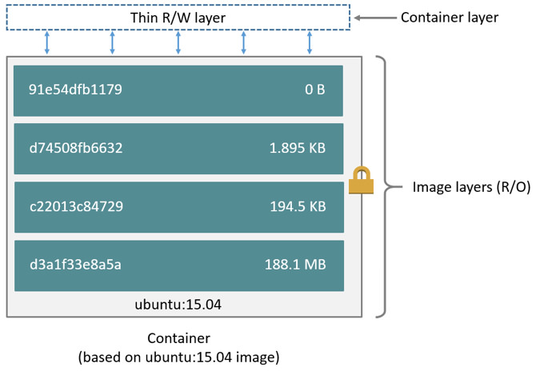
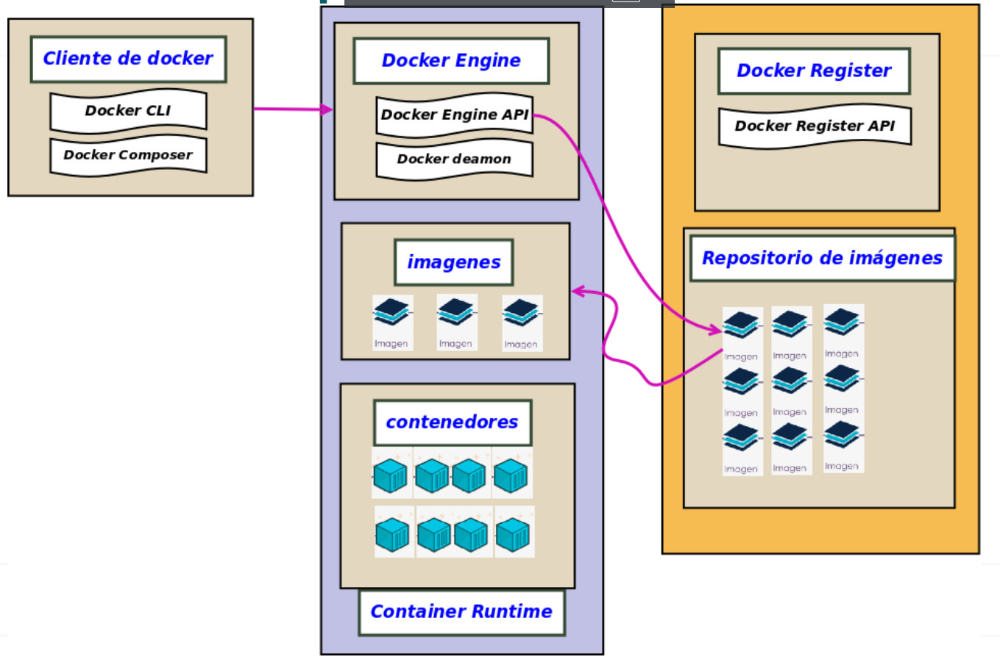

# Contenedores e imágenes



## La imagen

::: definicion La imagen

<Color>La imagen</Color> es una plantilla de solo lectura que contiene el sistema de archivos, las librerías, dependencias, aplicaciones y configuraciones necesarias para crear y ejecutar un contenedor.

Una misma imagen puede utilizarse como base para crear múltiples contenedores independientes.

:::

---



::: info Nota

Docker **no emula hardware** como lo hace una máquina virtual. Los contenedores comparten el kernel del sistema anfitrión y aíslan procesos, sistema de archivos, red y otros recursos.

Por tanto, **un contenedor no es una máquina virtual**, aunque pueda disponer de su propia configuración de red y dirección IP.

:::

## El contenedor

::: definicion El contenedor

Un <Color>contenedor</Color> es una instancia ejecutable de una imagen.

Sobre las capas de solo lectura de la imagen, Docker añade una **capa de lectura y escritura** propia del contenedor, donde se almacenan los cambios realizados durante su ejecución.

:::



> Imagen obtenida de: https://iesgn.github.io/curso_docker_2021/sesion2/organizacion.html

::: info Relación con la imagen

El contenedor se crea a partir de una imagen y mantiene una relación con ella. Una misma imagen puede servir como base para crear múltiples contenedores.

:::

::: info Capas

Los cambios realizados durante la ejecución de un contenedor se almacenan en su **capa de lectura y escritura**, sin modificar las capas de la imagen original.

Este sistema de capas contribuye a que Docker sea eficiente y ligero.

:::

## Contenedor e imagen

::: pageinfo La unión hace la fuerza

El funcionamiento de Docker se basa en crear **contenedores a partir de imágenes**, por lo que ambos conceptos están estrechamente relacionados.

::: warning Importante

Todo contenedor se crea a partir de **una imagen**.

:::

::: info Una imagen, muchos contenedores

Una misma imagen puede ser la base de **uno o muchos contenedores**.

Cada contenedor constituye una instancia independiente de los demás, con sus propios procesos, sistema de archivos escribible y configuración de red.

:::


:::

## Componentes de la arquitectura Docker



La arquitectura de Docker puede entenderse inicialmente a partir de tres elementos principales: el **cliente**, el **Docker Engine** y los **registries**.

### <Color>Cliente de Docker</Color>

El cliente es la parte con la que interactuamos directamente para enviar órdenes a Docker.

- <Color>Docker CLI</Color>: permite ejecutar comandos como `docker run`, `docker build`, `docker pull` o `docker ps`.
- <Color>Docker Compose</Color>: permite definir y ejecutar aplicaciones formadas por varios servicios mediante un fichero `compose.yaml`.
- El cliente se comunica con <Color>Docker Engine</Color> para solicitar la ejecución de las operaciones.

### <Color>Docker Engine</Color>

<Color>Docker Engine</Color> es el motor encargado de crear y gestionar imágenes, contenedores, redes y volúmenes.

Entre sus componentes podemos destacar:

- <Color>Docker Engine API</Color>: proporciona la interfaz mediante la que los clientes se comunican con Docker Engine.
- <Color>Docker daemon (`dockerd`)</Color>: proceso que se ejecuta en segundo plano y gestiona los objetos Docker, como imágenes, contenedores, redes y volúmenes.
- <Color>Container Runtime</Color>: conjunto de componentes responsables de la ejecución de los contenedores.

En la arquitectura podemos observar claramente la relación:

**Cliente → Docker Engine → imágenes y contenedores**

### <Color>Docker Registry</Color>

Un <Color>Docker Registry</Color> es un servicio que permite **almacenar y distribuir imágenes Docker**.

<Color>Docker Hub</Color> es el registry público utilizado por defecto por Docker.

Docker Engine puede comunicarse con un registry para:

- Descargar una imagen mediante `docker pull`.
- Subir una imagen mediante `docker push`.

Por tanto, podemos visualizar el flujo general como:

**Registry ⇄ Imagen → Contenedor**

El registry almacena imágenes; Docker Engine las descarga y, a partir de ellas, crea y ejecuta contenedores.

::: info Docker Buildx: un componente que no aparece en el esquema

En versiones actuales de Docker instalamos también **`docker-buildx-plugin`**.
Desde **Docker Engine 23.0**, Buildx se distribuye como un paquete independiente;
anteriormente estaba incluido dentro de `docker-ce-cli`.

<Color>Docker Buildx</Color> es la herramienta que gestiona la **construcción de imágenes**.
Cuando ejecutamos:

```bash{1}
docker build .
```
:::

Una imagen actual más completa sería 

:::tip
imagen generada por chat-gpt
:::
