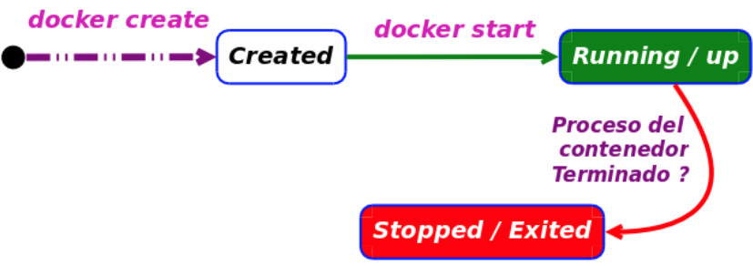
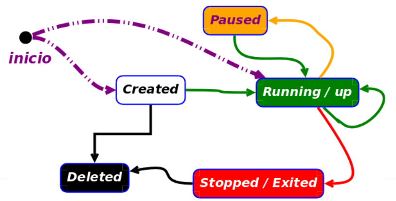
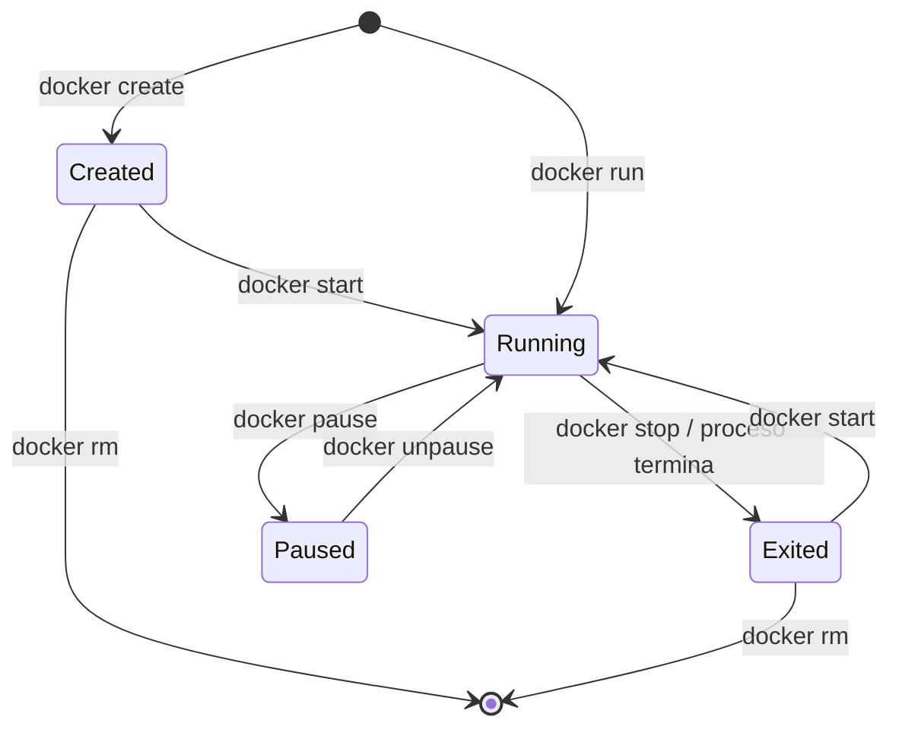
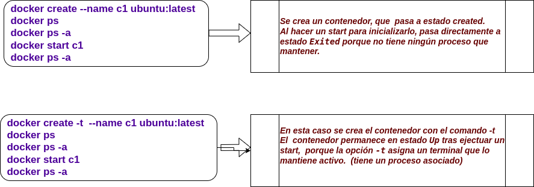
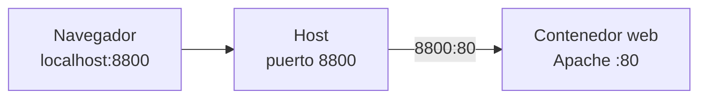

---
title: "Comandos básicos de Docker"
---

# Comandos básicos de Docker

::: objetivos Docker desde la terminal

Al terminar esta parte deberás ser capaz de:

- Descargar y consultar imágenes.
- Crear, arrancar, parar y eliminar contenedores.
- Entender los estados básicos de un contenedor.
- Ejecutar comandos dentro de un contenedor.
- Consultar logs e información de un contenedor.
- Publicar puertos.
- Compartir directorios entre el anfitrión y un contenedor.
- Modificar un contenedor y crear una nueva imagen con `commit`.
- Entender la diferencia entre una imagen y un contenedor.
- Crear manualmente un entorno con **PHP + Apache**.

:::

En este tema vamos a trabajar con Docker principalmente desde la terminal.

El objetivo no es memorizar comandos, sino entender **sobre qué elemento estamos actuando** y **qué cambio estamos produciendo**.

Podemos resumir inicialmente nuestro trabajo en:

```text
IMAGEN
   │
   │ create / run
   ▼
CONTENEDOR
   │
   │ start / stop
   ▼
EJECUCIÓN
   │
   ├── exec
   ├── logs
   ├── inspect
   └── ...
```

---

# 1. Trabajar con imágenes

::: definicion Imagen

Una <Color>imagen</Color> es una plantilla de solo lectura a partir de la cual Docker puede crear contenedores.

Una imagen puede utilizarse para crear **uno o muchos contenedores**.

:::

## Descargar una imagen: `docker pull`

<CmdPane>

<Cmd
name="docker pull"
mne="pull → traer"
example="docker pull ubuntu:24.04"
>

Descarga una imagen desde un registry. Si no indicamos otro, Docker utiliza **Docker Hub**.

</Cmd>

</CmdPane>

Por ejemplo:

```bash
docker pull ubuntu:24.04
```

Podemos leerlo como:

> Descarga la imagen `ubuntu` con la etiqueta `24.04`.

La parte situada después de `:` es el **tag**:

```text
ubuntu:24.04
│       │
│       └── tag
└────────── nombre de la imagen
```

::: warning Evita depender de `latest`

En muchos ejemplos encontrarás:

```bash
docker pull ubuntu:latest
```

pero para trabajar con entornos reproducibles es preferible indicar explícitamente la versión:

```bash
docker pull ubuntu:24.04
```

`latest` puede apuntar en el futuro a una versión diferente.

:::

## Ver las imágenes disponibles: `docker images`

<CmdPane>

<Cmd
name="docker images"
mne="images → imágenes"
example="docker images"
>

Muestra las imágenes disponibles localmente.

</Cmd>

</CmdPane>

```bash
docker images
```

Observa especialmente:

```text
REPOSITORY
TAG
IMAGE ID
CREATED
SIZE
```

## Buscar imágenes: `docker search`

También podemos buscar imágenes disponibles en Docker Hub:

```bash
docker search ubuntu
```

::: info Docker Hub

`docker search` realiza una búsqueda en Docker Hub.

Para buscar imágenes desde un navegador utilizaremos normalmente la propia web de Docker Hub, donde podremos consultar también documentación, tags y ejemplos de utilización.

:::

::: actividad Comprueba tus imágenes

Ejecuta:

```bash
docker images
```

Localiza la imagen `ubuntu` que acabas de descargar e identifica:

1. El nombre de la imagen.
2. Su tag.
3. Su identificador.
4. Su tamaño.

**Explica qué representa cada dato.**

:::

---

# 2. Crear un contenedor

::: definicion Contenedor

Un <Color>contenedor</Color> es una instancia creada a partir de una imagen que podemos ejecutar, detener y eliminar.

:::

Podemos crear un contenedor **sin arrancarlo**:

```bash
docker create --name prueba ubuntu:24.04
```

<CmdPane>

<Cmd
name="docker create"
mne="create → crear"
example="docker create --name prueba ubuntu:24.04"
>

Crea un contenedor a partir de una imagen, pero **no lo ejecuta**.

</Cmd>

</CmdPane>

La opción:

```text
--name prueba
```

asigna el nombre `prueba` al contenedor.



Podemos comprobar que el contenedor existe:

```bash
docker ps -a
```

Deberíamos encontrarlo en estado:

```text
Created
```

::: pregunta Piensa antes de continuar

¿Podríamos ejecutar ahora:

```bash
docker exec -it prueba bash
```

¿Por qué?

:::

---

# 3. Estados de un contenedor

Antes de continuar es importante entender que un contenedor puede encontrarse en diferentes estados.



Para empezar nos interesan especialmente:

| Estado | Qué significa |
| --- | --- |
| **Created** | El contenedor existe, pero todavía no se ha iniciado. |
| **Running / Up** | El proceso principal del contenedor está ejecutándose. |
| **Paused** | Los procesos del contenedor están temporalmente suspendidos. |
| **Exited** | El proceso principal ha terminado y el contenedor está detenido. |

::: info Estado y comandos

El estado del contenedor determina qué operaciones podemos realizar.

Por ejemplo, `docker exec` necesita que el contenedor se encuentre en estado **Running**.

:::



## Consultar contenedores

Para ver los contenedores en ejecución:

```bash
docker ps
```

Para ver **todos**, independientemente de su estado:

```bash
docker ps -a
```

<CmdPane>

<Cmd
name="docker ps"
mne="process status"
example="docker ps -a"
>

`docker ps` muestra los contenedores en ejecución.

Con `-a` mostramos todos los contenedores.

</Cmd>

</CmdPane>

---

# 4. Arrancar un contenedor: `docker start`

Un contenedor en estado `Created` puede iniciarse mediante:

```bash
docker start prueba
```

<CmdPane>

<Cmd
name="docker start"
mne="start → arrancar"
example="docker start prueba"
>

Arranca un contenedor que **ya existe**.

</Cmd>

</CmdPane>

Es importante distinguir:

```text
docker create
      │
      ▼
   Created
      │
      │ docker start
      ▼
   Running
```



::: info Create no es Start

`docker create` crea el contenedor.

`docker start` arranca un contenedor que ya existe.

Son dos operaciones diferentes.

:::

---

# 5. `docker run`: crear y arrancar

En la práctica utilizaremos con mucha frecuencia:

```bash
docker run
```

Podemos entender inicialmente:

```text
docker run ≈ docker create + docker start
```

Por ejemplo:

```bash
docker run --name prueba2 ubuntu:24.04
```

<CmdPane>

<Cmd
name="docker run"
mne="run → ejecutar"
example="docker run --name prueba2 ubuntu:24.04"
>

Crea un **nuevo contenedor** a partir de una imagen y lo arranca.

</Cmd>

</CmdPane>

::: warning `run` crea un contenedor nuevo

Cada vez que ejecutamos:

```bash
docker run ...
```

estamos solicitando la creación de **otro contenedor**.

Si el contenedor ya existe y queremos volver a arrancarlo utilizamos:

```bash
docker start nombre
```

:::

## `--name`: poner nombre al contenedor

```bash
docker run --name servidor ubuntu:24.04
```

Sin `--name`, Docker asignará automáticamente un nombre.

## `-it`: trabajar de forma interactiva

Podemos ejecutar:

```bash
docker run -it --name servidor ubuntu:24.04 bash
```

Las opciones:

```text
-i    interactive
-t    terminal
```

se utilizan habitualmente juntas:

```text
-it
```

Ahora tendremos una terminal dentro del contenedor.

Para salir:

```bash
exit
```

::: actividad Comprueba qué ha ocurrido

Después de salir ejecuta:

```bash
docker ps
docker ps -a
```

¿En qué estado está `servidor`?

Explica por qué ha cambiado de estado al ejecutar `exit`.

:::

## `--rm`: contenedores temporales

Podemos indicar a Docker que elimine automáticamente el contenedor cuando termine:

```bash
docker run --rm -it ubuntu:24.04 bash
```

Esto resulta muy útil para pruebas.

---

# 6. Ejecutar en segundo plano: `-d`

Un servidor normalmente debe continuar funcionando aunque recuperemos nuestro terminal.

Para ello utilizamos:

```text
-d
```

de **detached**.

Por ejemplo:

```bash
docker run -d --name web php:8.3-apache
```

El contenedor continúa ejecutándose en segundo plano.

Compruébalo:

```bash
docker ps
```

---

# 7. Ejecutar comandos dentro del contenedor: `docker exec`

Con un contenedor funcionando podemos ejecutar comandos en su interior:

```bash
docker exec -it web bash
```

<CmdPane>

<Cmd
name="docker exec"
mne="execute → ejecutar"
example="docker exec -it web bash"
>

Ejecuta un comando dentro de un contenedor que **ya está en ejecución**.

</Cmd>

</CmdPane>

Una vez dentro podemos utilizar comandos Linux:

```bash
pwd
ls
whoami
cat /etc/os-release
```

En nuestro contenedor PHP podemos comprobar:

```bash
php -v
apache2 -v
```

Para salir:

```bash
exit
```

::: warning `exec` necesita un contenedor en ejecución

No podemos ejecutar:

```bash
docker exec ...
```

sobre un contenedor que se encuentre en estado `Created` o `Exited`.

Debe estar:

```text
Running / Up
```

:::

---

# 8. Consultar los logs

Los contenedores ejecutan procesos y estos pueden generar información por su salida estándar y salida de error.

Podemos consultar esa información con:

```bash
docker logs web
```

<CmdPane>

<Cmd
name="docker logs"
mne="logs → registros"
example="docker logs -f web"
>

Muestra los logs generados por el proceso principal del contenedor.

</Cmd>

</CmdPane>

Para seguir los logs en tiempo real:

```bash
docker logs -f web
```

La opción:

```text
-f
```

significa **follow**.

Para mostrar únicamente las últimas líneas:

```bash
docker logs --tail 20 web
```

---

# 9. Inspeccionar un contenedor

Docker almacena mucha información sobre cada contenedor:

- Imagen utilizada.
- Estado.
- Dirección IP.
- Puertos.
- Volúmenes.
- Redes.
- Variables de entorno.
- Configuración.

Podemos consultarla mediante:

```bash
docker inspect web
```

<CmdPane>

<Cmd
name="docker inspect"
mne="inspect → inspeccionar"
example="docker inspect web"
>

Muestra información detallada sobre un objeto Docker.

</Cmd>

</CmdPane>

La salida está en formato JSON.

::: actividad Busca información

Ejecuta:

```bash
docker inspect web
```

Intenta localizar:

- El estado del contenedor.
- La imagen utilizada.
- Su dirección IP.
- Los puertos configurados.

No necesitas comprender todavía toda la información mostrada.

:::

---

# 10. Publicar puertos

Supongamos que Apache escucha en:

```text
puerto 80
```

dentro del contenedor.

Eso **no significa automáticamente** que podamos acceder desde el navegador de nuestro ordenador.

Tenemos que publicar el puerto:

```bash
docker run -d \
  --name web \
  -p 8800:80 \
  php:8.3-apache
```

La expresión:

```text
8800:80
```

significa:

```text
HOST                         CONTENEDOR

puerto 8800  ─────────────►  puerto 80
```



Ahora podemos acceder desde el navegador a:

```text
http://localhost:8800
```

::: pregunta Comprueba que lo entiendes

En:

```bash
-p 8800:80
```

1. ¿Qué puerto pertenece al anfitrión?
2. ¿Qué puerto pertenece al contenedor?
3. ¿En qué puerto está escuchando realmente Apache?

:::

---

# 11. Compartir una carpeta con el contenedor

Queremos editar nuestros ficheros PHP desde PhpStorm o VS Code y que Apache, dentro del contenedor, pueda utilizarlos.

Creamos:

```bash
mkdir app
```

y dentro:

```text
app/index.php
```

Por ejemplo:

```php
<?php

echo "Hola desde Docker";
```

Podemos compartir ese directorio con el contenedor:

```bash
docker run -d \
  --name web \
  -p 8800:80 \
  -v "$PWD/app:/var/www/html" \
  php:8.3-apache
```

La opción:

```text
-v "$PWD/app:/var/www/html"
```

relaciona:

```text
HOST                              CONTENEDOR

./app              ───────────►   /var/www/html
index.php                         index.php
```

::: definicion Bind mount

Un **bind mount** permite montar un directorio del anfitrión dentro del sistema de archivos del contenedor.

Los ficheros continúan estando físicamente en nuestro equipo y podemos modificarlos utilizando nuestro IDE.

:::

Modifica ahora `index.php` y recarga:

```text
http://localhost:8800
```

El cambio debería aparecer inmediatamente.

::: info La carpeta no forma parte de la imagen

Los ficheros del bind mount viven en el anfitrión.

Por tanto, modificar:

```text
./app/index.php
```

no modifica la imagen Docker.

Esta diferencia será importante cuando estudiemos `docker commit` y posteriormente **Dockerfile**.

:::

---

# 12. Modificar un contenedor

Hasta ahora hemos utilizado imágenes ya preparadas.

Pero podemos partir de una imagen sencilla y modificar manualmente un contenedor.

Creamos uno basado en Ubuntu:

```bash
docker run -it --name servidor ubuntu:24.04 bash
```

Dentro podemos instalar software:

```bash
apt update
apt install -y apache2 php
```

Comprobamos:

```bash
php -v
apache2 -v
```

Ahora nuestro contenedor **ya no es exactamente igual que la imagen original**.

Partimos de:

```text
ubuntu:24.04
```

pero hemos añadido:

```text
Apache
PHP
dependencias
configuraciones
```

---

# 13. Ver los cambios: `docker diff`

Docker puede mostrarnos qué cambios se han producido en el sistema de archivos del contenedor:

```bash
docker diff servidor
```

<CmdPane>

<Cmd
name="docker diff"
mne="difference → diferencias"
example="docker diff servidor"
>

Muestra los cambios realizados en el sistema de archivos del contenedor respecto a su imagen.

</Cmd>

</CmdPane>

En la salida podemos encontrar:

```text
A    añadido
C    modificado
D    eliminado
```

::: info Imagen y capa escribible

La imagen original no se modifica.

Los cambios que realizamos se almacenan en la **capa escribible del contenedor**.

Esto explica por qué podemos crear muchos contenedores independientes partiendo de la misma imagen.

:::

---

# 14. Crear una imagen desde un contenedor: `docker commit`

Tenemos ahora:

```text
ubuntu:24.04
     │
     │ docker run
     ▼
┌──────────────────────┐
│      servidor        │
│                      │
│ + Apache             │
│ + PHP                │
│ + modificaciones     │
└──────────────────────┘
```

Podemos convertir el estado del contenedor en una **nueva imagen**:

```bash
docker commit servidor php-apache:v1
```

<CmdPane>

<Cmd
name="docker commit"
mne="commit → guardar cambios"
example="docker commit servidor php-apache:v1"
>

Crea una nueva imagen a partir de los cambios realizados en un contenedor.

</Cmd>

</CmdPane>

El proceso puede visualizarse así:

```text
ubuntu:24.04
     │
     │ docker run
     ▼
  servidor
     │
     │ instalamos Apache + PHP
     ▼
contenedor modificado
     │
     │ docker commit
     ▼
php-apache:v1
```

Comprueba que la nueva imagen existe:

```bash
docker images
```

Ahora tenemos **dos imágenes diferentes**:

```text
ubuntu:24.04
php-apache:v1
```

::: warning Los volúmenes no forman parte del commit

Los datos que se encuentren en volúmenes o bind mounts no se incorporan a la nueva imagen mediante `docker commit`.

`commit` recoge los cambios realizados en el sistema de archivos propio del contenedor.

:::

---

# 15. Crear otro contenedor desde nuestra imagen

La mejor forma de comprobar que realmente hemos creado una imagen es crear **otro contenedor**.

```bash
docker run -it --name servidor2 php-apache:v1 bash
```

Dentro:

```bash
php -v
apache2 -v
```

PHP y Apache deberían estar ya instalados.

¿Por qué?

Porque ahora forman parte de:

```text
php-apache:v1
```

y no los hemos instalado en `servidor2`.

::: pregunta Imagen frente a contenedor

Tenemos:

```text
php-apache:v1
```

y hemos creado:

```text
servidor2
```

¿Cuál de los dos es la imagen?

¿Cuál es el contenedor?

¿Podríamos crear `servidor3`, `servidor4` y `servidor5` a partir de la misma imagen?

:::

---

# 16. Consultar las capas: `docker history`

Podemos consultar cómo está formada una imagen mediante:

```bash
docker history php-apache:v1
```

<CmdPane>

<Cmd
name="docker history"
mne="history → historial"
example="docker history php-apache:v1"
>

Muestra el historial de capas que forman una imagen.

</Cmd>

</CmdPane>

Esto nos ayuda a entender que una imagen Docker no es simplemente un único fichero monolítico, sino que está formada por **capas**.

---

# 17. ¿Por qué necesitaremos un Dockerfile?

Hemos conseguido crear nuestra propia imagen:

```text
php-apache:v1
```

pero piensa en cómo lo hemos hecho:

```text
1. Crear contenedor
2. Entrar
3. apt update
4. instalar Apache
5. instalar PHP
6. realizar modificaciones
7. docker commit
```

::: pregunta Reproducibilidad

Si entregásemos únicamente:

```text
php-apache:v1
```

a otro compañero:

¿Sabría exactamente todos los pasos que hemos realizado?

¿Podría reconstruir automáticamente la misma imagen?

¿Y dentro de seis meses recordaríamos nosotros todos esos pasos?

:::

`docker commit` nos ha permitido comprender cómo un contenedor modificado puede convertirse en una imagen.

Pero **no es la forma adecuada de documentar y automatizar la construcción de nuestras imágenes**.

En el siguiente tema utilizaremos un:

```text
Dockerfile
```

donde escribiremos las instrucciones necesarias para construir la imagen de forma **declarativa, repetible y versionable**.

```text
AHORA                               SIGUIENTE TEMA

contenedor                          Dockerfile
    │                                   │
    │ modificaciones                    │ instrucciones
    │ manuales                           │
    ▼                                   ▼
docker commit                       docker build
    │                                   │
    └────────────► IMAGEN ◄─────────────┘
```

---

# 18. Parar y volver a arrancar

Para detener un contenedor:

```bash
docker stop web
```

<CmdPane>

<Cmd
name="docker stop"
mne="stop → parar"
example="docker stop web"
>

Solicita la finalización del proceso principal del contenedor.

</Cmd>

</CmdPane>

Comprueba:

```bash
docker ps
docker ps -a
```

El contenedor sigue existiendo.

Simplemente está detenido.

Para volver a arrancarlo:

```bash
docker start web
```

::: info `stop` no elimina

Después de:

```bash
docker stop web
```

el contenedor continúa existiendo.

Por eso podemos volver a ejecutar:

```bash
docker start web
```

sin crearlo de nuevo.

:::

También disponemos de:

```bash
docker restart web
```

que realiza una parada y posterior arranque.

---

# 19. Pausar un contenedor

Podemos suspender temporalmente sus procesos:

```bash
docker pause web
```

Y reanudarlos:

```bash
docker unpause web
```

La diferencia conceptual es:

```text
pause
  │
  └── los procesos quedan congelados

stop
  │
  └── el proceso principal termina
```

::: actividad Pause frente a Stop

Arranca un contenedor interactivo.

Desde otro terminal ejecuta:

```bash
docker pause nombre
```

Observa qué ocurre.

Después:

```bash
docker unpause nombre
```

Finalmente prueba:

```bash
docker stop nombre
```

Explica la diferencia observada.

:::

---

# 20. Eliminar contenedores

Para eliminar un contenedor:

```bash
docker rm web
```

Normalmente deberá estar detenido previamente:

```bash
docker stop web
docker rm web
```

Podemos forzar la eliminación:

```bash
docker rm -f web
```

::: warning `stop` y `rm` son diferentes

```text
docker stop
```

detiene el contenedor.

```text
docker rm
```

elimina el contenedor.

Un contenedor detenido **sigue existiendo**.

:::

---

# 21. Eliminar imágenes

Para eliminar una imagen:

```bash
docker rmi php-apache:v1
```

<CmdPane>

<Cmd
name="docker rmi"
mne="remove image"
example="docker rmi php-apache:v1"
>

Elimina una imagen local.

</Cmd>

</CmdPane>

Docker puede impedir eliminar una imagen si todavía existen contenedores que dependen de ella.

::: warning `rm` frente a `rmi`

No confundas:

```bash
docker rm
```

con:

```bash
docker rmi
```

Podemos recordarlo como:

```text
rm      → remove container
rmi     → remove image
```

:::

---

# 22. Monitorizar recursos: `docker stats`

Podemos observar el consumo de recursos de los contenedores:

```bash
docker stats
```

La información incluye, entre otros:

- CPU.
- Memoria.
- Red.
- Procesos.

Para salir:

```text
Ctrl + C
```

::: info Observabilidad básica

`docker ps`, `docker logs`, `docker inspect` y `docker stats` responden a preguntas diferentes:

```text
docker ps       → ¿qué está ejecutándose?
docker logs     → ¿qué está diciendo el proceso?
docker inspect  → ¿cómo está configurado?
docker stats    → ¿qué recursos está consumiendo?
```

:::

---

# 23. Espacio utilizado por Docker

Docker puede acumular:

- Imágenes.
- Contenedores.
- Volúmenes.
- Caché de construcción.

Podemos consultar el espacio utilizado mediante:

```bash
docker system df
```

Para obtener más detalle:

```bash
docker system df -v
```

---

# 24. Guardar y cargar imágenes

Podemos guardar una imagen en un fichero:

```bash
docker image save -o php-apache.tar php-apache:v1
```

Y posteriormente recuperarla:

```bash
docker image load -i php-apache.tar
```

Esto permite transportar una imagen sin necesidad de utilizar un registry.

```text
php-apache:v1
      │
      │ docker image save
      ▼
php-apache.tar
      │
      │ copiar fichero
      ▼
OTRO EQUIPO
      │
      │ docker image load
      ▼
php-apache:v1
```

::: warning `save/load` no es `export/import`

Para trabajar con **imágenes** utilizaremos:

```text
docker image save
docker image load
```

`docker export` y `docker import` trabajan con el sistema de archivos de un **contenedor** y tienen una finalidad diferente.

:::

---

# 25. Docker Hub: `login`, `tag` y `push`

Hasta ahora hemos descargado imágenes:

```bash
docker pull ubuntu:24.04
```

Pero también podemos publicar nuestras propias imágenes en un registry.

Primero iniciamos sesión:

```bash
docker login
```

Para publicar una imagen en Docker Hub necesitaremos etiquetarla con el nombre correspondiente al repositorio:

```bash
docker tag php-apache:v1 usuario/php-apache:v1
```

Y después:

```bash
docker push usuario/php-apache:v1
```

El flujo sería:

```text
IMAGEN LOCAL

php-apache:v1
      │
      │ docker tag
      ▼
usuario/php-apache:v1
      │
      │ docker push
      ▼
DOCKER HUB
```

Otro usuario podría posteriormente ejecutar:

```bash
docker pull usuario/php-apache:v1
```

::: info `tag` no duplica la imagen

`docker tag` no crea una copia completa de la imagen.

Crea otra referencia o nombre para identificarla.

Puedes comprobarlo observando el `IMAGE ID` mediante:

```bash
docker images
```

:::

---

# 26. Limpieza

Durante las prácticas iremos creando imágenes y contenedores.

Podemos eliminar recursos no utilizados mediante:

```bash
docker system prune
```

::: danger Utiliza `prune` con cuidado

No utilices:

```bash
docker system prune
```

simplemente porque quieres «dejar Docker limpio».

El comando elimina recursos que Docker considera no utilizados.

Especialmente peligroso puede ser añadir:

```bash
--volumes
```

porque puede eliminar datos persistentes.

Antes de borrar, debemos saber **qué estamos eliminando y por qué**.

:::

---

# 27. Mapa de comandos

Llegados a este punto podemos clasificar los comandos según el objeto sobre el que actúan.

## Imágenes

```text
docker pull
docker images
docker search
docker history
docker rmi
docker image save
docker image load
docker tag
docker push
```

## Contenedores

```text
docker create
docker run
docker start
docker stop
docker restart
docker pause
docker unpause
docker ps
docker exec
docker logs
docker inspect
docker diff
docker stats
docker rm
```

## De contenedor a imagen

```text
docker commit
```

## Sistema Docker

```text
docker system df
docker system prune
```

::: info Dos preguntas fundamentales

Cuando dudes sobre qué comando necesitas, empieza preguntándote:

**1. ¿Estoy trabajando con una imagen o con un contenedor?**

Y, si estás trabajando con un contenedor:

**2. ¿En qué estado se encuentra?**

Entender estas dos cuestiones es más importante que memorizar una lista de comandos.

:::

---

# Práctica — De Ubuntu a nuestro servidor PHP + Apache

En esta práctica vamos a recorrer el ciclo completo:

```text
IMAGEN BASE
ubuntu:24.04
      │
      ▼
CONTENEDOR
servidor
      │
      │ instalar
      ▼
Apache + PHP
      │
      │ docker commit
      ▼
NUEVA IMAGEN
php-apache:v1
      │
      ▼
NUEVO CONTENEDOR
      │
      │ publicar puerto
      ▼
NAVEGADOR
```

El objetivo no es únicamente conseguir que funcione.

Debes ser capaz de **explicar qué estás haciendo en cada paso**.

---

### Parte 1 — Obtener la imagen

Descarga:

```text
ubuntu:24.04
```

Después comprueba que está disponible localmente.

Debes identificar:

- Nombre.
- Tag.
- IMAGE ID.
- Tamaño.

::: actividad Documenta el paso

Indica:

1. Qué comando has utilizado.
2. Qué hace.
3. De dónde se ha descargado la imagen.
4. Qué significa `24.04`.
5. Cómo has comprobado que la imagen está disponible.

:::

---

### Parte 2 — Crear nuestro primer contenedor

Crea un contenedor llamado:

```text
servidor
```

pero **sin arrancarlo inicialmente**.

Utiliza para ello el comando estudiado en este tema.

Comprueba después su estado.

::: actividad Explica

Debes indicar:

- Qué comando has utilizado.
- Qué imagen has utilizado.
- Para qué sirve `--name`.
- En qué estado queda el contenedor.
- Cómo has comprobado dicho estado.

:::

---

### Parte 3 — Arrancar el contenedor

Arranca:

```text
servidor
```

sin crear otro contenedor.

Comprueba nuevamente su estado.

::: pregunta

¿Cuál es la diferencia entre:

```text
docker create
docker start
docker run
```

?

Explícalo con tus propias palabras.

:::

---

### Parte 4 — Trabajar dentro del contenedor

Debes conseguir una terminal interactiva dentro del contenedor.

Una vez dentro identifica:

```bash
cat /etc/os-release
```

y comprueba si están instalados:

```bash
php -v
apache2 -v
```

::: actividad Explica

Indica:

- Qué comando utilizas para ejecutar algo dentro de un contenedor.
- Qué significan `-i` y `-t`.
- En qué estado debe encontrarse el contenedor.
- Qué resultado obtienes al consultar PHP y Apache.

:::

---

### Parte 5 — Instalar PHP y Apache

Dentro del contenedor instala:

- Apache.
- PHP.

Comprueba posteriormente sus versiones.

No continúes hasta poder ejecutar correctamente:

```bash
php -v
apache2 -v
```

::: actividad Explica

Documenta:

1. Los comandos ejecutados.
2. Para qué sirve cada uno.
3. Qué software has instalado.
4. Cómo has comprobado que la instalación ha funcionado.

:::

---

### Parte 6 — Observar los cambios

Desde el anfitrión utiliza:

```bash
docker diff servidor
```

Analiza parte de su salida.

::: pregunta

¿Por qué aparecen ahora tantos cambios si nuestra imagen original era:

```text
ubuntu:24.04
```

?

¿Qué representan:

```text
A
C
D
```

?

:::

---

### Parte 7 — Crear nuestra propia imagen

A partir del contenedor:

```text
servidor
```

crea una imagen llamada:

```text
php-apache:v1
```

Comprueba después que aparece entre tus imágenes locales.

::: actividad Explica

Debes indicar:

- Qué comando has utilizado.
- Qué elemento es `servidor`.
- Qué elemento es `php-apache:v1`.
- Qué significa `v1`.
- Qué relación existe entre `ubuntu:24.04` y `php-apache:v1`.

:::

---

### Parte 8 — Investigar nuestra imagen

Consulta:

```bash
docker history php-apache:v1
```

y compara el resultado con:

```bash
docker history ubuntu:24.04
```

::: pregunta

¿Qué diferencias observas?

¿Puedes relacionarlas con los cambios que realizaste en el contenedor?

:::

---

### Parte 9 — La prueba definitiva

Crea **un nuevo contenedor** a partir de:

```text
php-apache:v1
```

No vuelvas a instalar PHP ni Apache.

Comprueba directamente:

```bash
php -v
apache2 -v
```

::: pregunta

¿Por qué están instalados PHP y Apache si nunca los has instalado en este nuevo contenedor?

Explica la relación:

```text
ubuntu:24.04
      ↓
servidor
      ↓
php-apache:v1
      ↓
nuevo contenedor
```

:::

---

### Parte 10 — Servir una página PHP

Crea una página:

```text
index.php
```

que genere alguna salida mediante PHP.

Debes conseguir que Apache la sirva y poder acceder desde el navegador del anfitrión mediante un puerto publicado.

El resultado final debe ser accesible mediante una dirección similar a:

```text
http://localhost:8080
```

::: warning Aquí puede aparecer un problema interesante

Tener Apache instalado en una imagen **no significa necesariamente que Apache vaya a ser automáticamente el proceso que se ejecute al arrancar un nuevo contenedor**.

Si encuentras este problema:

1. Identifícalo.
2. Explica qué está ocurriendo.
3. Busca una forma de arrancar Apache en primer plano.

No necesitamos todavía construir la solución perfecta.

Precisamente este problema nos ayudará a entender **por qué necesitamos un Dockerfile** en el siguiente tema.

:::

---

### Parte 11 — Inspeccionar y comprobar

Sobre el contenedor final utiliza:

```text
docker ps
docker inspect
docker logs
docker stats
```

Para cada comando explica **qué pregunta te permite responder**.

Por ejemplo:

```text
docker ps
```

responde a:

> ¿Está mi contenedor ejecutándose?

Busca preguntas equivalentes para los otros comandos.

---

### Parte 12 — Ciclo de vida

Sobre el contenedor final realiza:

```text
parar
comprobar estado
volver a arrancar
comprobar estado
```

Después elimínalo.

Comprueba que:

- El contenedor ha desaparecido.
- La imagen `php-apache:v1` sigue existiendo.

::: pregunta

¿Por qué eliminar el contenedor no elimina también la imagen?

:::

---

# Entrega de la práctica

::: actividad Qué debes entregar

Documenta el proceso completo.

Para **cada paso relevante** debes indicar:

1. **Qué quieres conseguir.**
2. **Qué comando utilizas.**
3. **Qué significa cada opción utilizada.**
4. **Qué resultado esperas obtener.**
5. **Cómo compruebas que ha funcionado.**
6. **Qué has aprendido de ese paso.**

Incluye las capturas que consideres necesarias para demostrar el funcionamiento.

No se evaluará únicamente que PHP y Apache funcionen.

El objetivo es que seas capaz de explicar el recorrido completo:

**imagen base → contenedor → modificaciones → nueva imagen → nuevo contenedor → aplicación accesible**

:::

---

# Y ahora... ¿Dockerfile?

Hemos conseguido crear nuestra propia imagen utilizando comandos y modificando manualmente un contenedor.

Funciona.

Pero tenemos un problema:

```text
¿Dónde están documentados todos los pasos
necesarios para volver a construir la imagen?
```

En el siguiente tema veremos cómo convertir algo parecido a:

```text
crear Ubuntu
instalar Apache
instalar PHP
configurar
copiar aplicación
definir cómo arrancar
```

en un fichero de texto reproducible:

```text
Dockerfile
```

Pasaremos de:

```text
hacer cambios manualmente
        ↓
docker commit
```

a:

```text
describir los cambios
        ↓
Dockerfile
        ↓
docker build
```

Ese será nuestro siguiente paso.