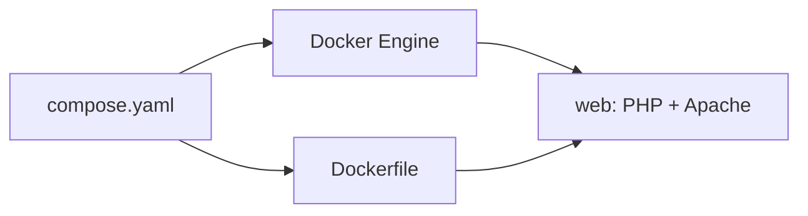

::: definicion Docker Compose
Un YAML que declara **servicios**, red y volúmenes, y el comando que los levanta juntos. Un `docker compose up` crea (si hace falta) imagen, red y contenedores.
:::

Un `docker run` con cinco flags se olvida. El laboratorio de clase son **dos ficheros** al lado del código: `Dockerfile` y `compose`.



El comando actual es el **plugin** (`docker compose`, con espacio), no `docker-compose`.

<CmdPane>
<Cmd name="docker compose up" mne="up" example="docker compose up -d --build">

Levanta el proyecto. `-d` en segundo plano. `--build` reconstruye la imagen si cambió el Dockerfile.

</Cmd>

<Cmd name="docker compose ps" mne="ps" example="docker compose ps">

Estado de **estos** servicios (no de todos los contenedores de tu máquina).

</Cmd>

<Cmd name="docker compose logs" mne="logs" example="docker compose logs -f">

Logs del conjunto. `-f` sigue la salida.

</Cmd>

<Cmd name="docker compose down" mne="down" example="docker compose down">

Para y quita los contenedores del proyecto. Los volúmenes nombrados se quedan, salvo `--volumes`.

</Cmd>
</CmdPane>

YAML: la **indentación** agrupa; espacio después de `:`. Un tab mal puesto tira el fichero.

## El laboratorio de DWES


```text
proyecto/
  docker/
    Dockerfile
    compose.yaml
  app/
    index.php
```

```yaml
services:
  web:
    build: .
    ports:
      - "8800:80"
    volumes:
      - ../app:/var/www/html
    container_name: web
```

- <Color>build: .</Color> usa el `Dockerfile` de esa carpeta
- <Color>8800:80</Color> → `http://localhost:8800`
- <Color>../app:/var/www/html</Color> → editas en PhpStorm, Apache sirve al instante
- <Color>container_name: web</Color> → `docker exec -it web bash`

Desde el directorio del compose:

```bash
docker compose up -d --build
```

## Cuando entre la base de datos

Un solo contenedor con Apache + PHP + MySQL **funciona** y es un lío. Mejor un servicio por proceso. Compose les pone una red: desde PHP el host de MySQL **no** es `localhost`, es el **nombre del servicio** (`db`).

```yaml
services:
  web:
    build: .
    ports:
      - "8800:80"
    volumes:
      - ../app:/var/www/html
    depends_on:
      - db
  db:
    image: mysql:8.0
    environment:
      MYSQL_ROOT_PASSWORD: root
      MYSQL_DATABASE: ejemplo
      MYSQL_USER: usuario
      MYSQL_PASSWORD: secreto
    volumes:
      - dbdata:/var/lib/mysql

volumes:
  dbdata:
```

Eso llega con persistencia y formularios. El día uno del laboratorio basta el servicio `web`.

::: pageinfo Si “el contenedor no arranca”
1. `docker compose ps` — ¿está `Up` o `Exit`?
2. `docker compose logs -f` — el error suele estar al final
3. Puerto 8800 ocupado: cambia el izquierdo (`8801:80`) o cierra lo que lo usa
4. Permiso denegado al socket: [instalación](/02_entornos_herramientas/docker/03_instalacion) (grupo `docker`)
:::

::: info Despliegue, no esta semana
Cuando varios sitios quieren el puerto 80 del servidor, no publicas `80:80` en cada compose. Eso es un **proxy inverso**. Lo veréis en el módulo de despliegue; aquí nos basta `localhost:8800`.
:::
