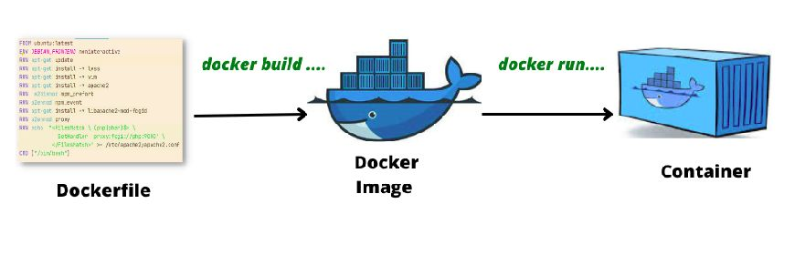

::: definicion Dockerfile
Es un fichero de texto que contiene una serie de <color>instrucciones</color> para <color>crear una imagen</color> .

- Este fichero tiene un formato concreto y necesita al menos la instrucción FROM para especificar la imagen base a partir de la cual construiremos nuestra imagen personalizada.

- Dichas instrucciones van a personalizar la imagen según nuestras necesidades
:::

:::warning Objetivo del fichero DockerFile
Partiendo de una imagen, con las instrucciones que especifiquemos, vamos a  personalizar la imagen quequeremos crear,

Después, a partir de esta imagen, levantaremos el contenedor)
:::


___

Para ejecutar las instrucciones del Dockerfile, utilizamos el comando < color > docker build < /color >:

```php{1}
docker build [OPTIONS] PATH | URL | -
```
Por ejemplo:
```bash{1}
docker build -t web:v1 .
```

El `.` es el **contexto** (archivos que Docker puede copiar). Build buscará en su contexto un fichero llamado <color>Dockerfile</color>, en este caso, buscaría en el directorio actual.

Con la  opción < color > PATH < /color > se puede  especificar la ubicación del <color>Dockerfile</color>.

< color > Si el fichero tiene otro nombre < /color > lo indicamos con la opción < color > -f < /color >.

:::tip Las imágenes de docker se construyen por capas
Cada instrucción genera una **capa**. Si cambias una, se invalidan las de debajo: <color>Colocaremos las primeras  instrucciones aquellas instalaciones que menos cambian </color>
:::

## Instrucciones de clase

| Instrucción | Para qué |
| --- | --- |
| **FROM** | Imagen base. Primera instrucción real. |
| `RUN` | Ejecuta comandos **en el build**, (en la construcción de la imagen) (instalar paquetes). |
| `COPY` | Copiar del contexto a la imagen. Prefiérelo a `ADD`. |
| `ENV` | Variables en build (en la construcción) **y** en el contenedor. |
| `ARG` | Variables solo  durante el `build`. |
| `EXPOSE` | Documenta puertos; **no** los publica. (Instrucción declarativa)|
| `VOLUME` | Documenta volúmenos; **no** los crea. (Instrucción declarativa)|
| `CMD` / `ENTRYPOINT` | Proceso principal al arrancar (PID 1).Es el comando predeterminado del contenedor |
| `WORKDIR` | Directorio de trabajo. |


## El proceso principal del contenedor: PID 1

Un contenedor siempre tiene un  proceso principal que se identifica con el PID1.

Es el sentido de su existencia, cuando ese proceso termina, el contenedor pasa a estado <color>Exited</color>

El contenedor, salvo que se especifique explíctamente, va a tener como PID1 el proceso que se  indicado mediante las instrucciones <color>CMD / ENTRYPOINT</color> y, como hemos comentado determina su ciclo de vida:<color>Un contenedor existe para ejecutar un proceso principal</color>

:::tip _Recuerda_
* Mientras el <color>proceso principal está ejecutándose</color> → el contenedor está <color>Running</color>.

* Cuando el <color>proceso principal termina</color> → el contenedor pasa a <color>Exited</color>.
:::

Para lanzar En el caso de  Apache se lanza **en primer plano**, no con <color>service apache2 start</color> ya que eso haría que el contenedor no nos sirviese para nuestro objetivo:

```dockerfile
CMD ["apache2ctl", "-D", "FOREGROUND"]
```

En `php:8.3-apache` eso ya viene resuelto. Si construyes desde `ubuntu`, lo tienes que poner tú.

::: tip RUN y apt
`apt-get update` y el `install` en la **misma** capa, y al final `rm -rf /var/lib/apt/lists/*`, para no dejar caché inútil en la imagen.
:::

Siguiente paso: no lanzar esto a mano cada vez, sino un [Compose](/02_entornos_herramientas/docker/compose) que haga `build`, puertos y volumen.

## FROM

```dockerfile
FROM ubuntu:latest
```

Esta instrucción es obligatoria y debe ser la primera, salvo comentarios o <Color>ARG</Color>.

Especifica la imagen base de la que partimos

:::tip
Intenta evitar usar versiones <color>latest</color>
:::
---

## `RUN`: Ejecución de comandos

Esta instrucción especifica una acción que se va a ejectuar dentro de la imagen que estamos construyendo

Es de las instrucciones más utilizada, y sirve para añadir paquetes a nuestra imagen

### Instalación de paquetes

> *Lo primero que debemos hacer es ejecutar <Color>apt-get update</Color>, lo que actualiza la información de los repositorios para garantizar que conocemos las versiones de los paquetes disponibles.*

> *Observa que se utiliza la opción <Color>-y</Color> para confirmar automáticamente las instalaciones, evitando la necesidad de interacción manual (dicha interacción no es posible, pues detendría la construcción de la imagen) durante la construcción de la imagen.*

```dockerfile{1-2}
RUN apt-get update && apt-get install -y apache2
RUN apt-get install -y php git zip
```

Cada instrucción <Color>RUN</Color> genera una capa.

Modificar una capa afecta a las siguientes, por lo que conviene agrupar comandos relacionados para optimizar la construcción de la imagen.

---

### Ejecución de scripts
También es posible ejecutar un script dentro de la imagen

```dockerfile
RUN bash script.sh
```

---
## Declaración de variables: `ENV` y `ARG`

### `ENV`

```dockerfile
FROM ubuntu:latest
ENV USER=developer
RUN echo "Usuario actual: $USER"
```

### `ARG`

```dockerfile
ARG VERSION=latest
FROM ubuntu:$VERSION
```

Construcción con argumentos personalizados:

```bash
docker build --build-arg VERSION=20.04 -t mi_imagen .
```

---

## Ejemplo: Personalización con `RUN`

Podemos ejecutar comandos de administración, instalación y scripts predefinidos:

```dockerfile
RUN mkdir -p /var/www/app && chown -R www-data:www-data /var/www/app
RUN apt-get update && apt-get install -y composer
RUN composer install --no-scripts --no-autoloader
```

---

## Práctica sugerida: Crear un Dockerfile

1. Partir de la imagen base `ubuntu:latest`.
2. Instalar los paquetes necesarios:
    - `apache2`
    - `vim`
    - `git`
    - `zip`

```dockerfile
FROM ubuntu:latest
RUN apt-get update && apt-get install -y apache2 vim git zip
```

---

## Declaración de variables: `ENV` vs `ARG`


Diferencias clave:

- **`ENV`**: define variables de entorno que quedan disponibles en la imagen y, por defecto, en los contenedores creados a partir de ella.
- **`ARG`**: define argumentos disponibles durante la construcción de la imagen.

### Ejemplo de uso: `ARG`

```dockerfile
ARG VERSION=latest
FROM ubuntu:$VERSION
```

Construcción personalizada:

```bash
docker build --build-arg VERSION=18.10 -t web:v1 .
```

### Ejemplo de uso: `ENV`

```dockerfile
FROM ubuntu:latest
ENV USER=manuel
RUN echo "Usuario configurado: $USER"
```

---

## Solución de problemas: Instalación de PHP

### Problema

Al instalar determinados paquetes puede solicitarse información de forma interactiva, como la configuración de la zona horaria. Esto puede interrumpir la construcción de la imagen.


### Solución

Configurar el entorno en modo no interactivo:

```dockerfile
ARG DEBIAN_FRONTEND=noninteractive
RUN apt-get update && apt-get install -y php libapache2-mod-php
```

Configurar la zona horaria:

```dockerfile
RUN ln -snf /usr/share/zoneinfo/Europe/Madrid /etc/localtime && \
    echo "Europe/Madrid" > /etc/timezone
```

---

## Etiquetas (`LABEL`)

Podemos agregar metadatos útiles a la imagen:

```dockerfile
FROM ubuntu:latest

LABEL maintainer="example@example.com"
LABEL version="1.0"
LABEL description="Imagen personalizada para aplicaciones web"
```

Podemos consultar las etiquetas mediante:

```bash
docker inspect --format '{{.Config.Labels}}' container_name
```

---

## Gestión de archivos: `COPY` y `ADD`

### Ejemplo: Crear usuarios desde un script

Archivos necesarios:

1. `usuarios.txt`:

```text
maria
nives
luis
lourdes
manuel
```

2. `crea_usuarios.sh`:

```bash
while IFS= read -r line
do
    useradd -m "$line"
done < usuarios.txt
```

Dockerfile:

```dockerfile
FROM ubuntu:latest

COPY crea_usuarios.sh /
COPY usuarios.txt /

RUN bash /crea_usuarios.sh
```

> Para copiar archivos locales utilizaremos normalmente `COPY`. `ADD` tiene funcionalidades adicionales y no es necesario para este ejemplo.

---

## Comandos: `CMD` y `ENTRYPOINT`

Ambas instrucciones están relacionadas con el comando que se ejecutará cuando se cree y arranque un contenedor a partir de la imagen.

### `CMD`

`CMD` establece el <Color>comando por defecto</Color>.

```dockerfile
CMD ["apache2ctl", "-D", "FOREGROUND"]
```

Al ejecutar:

```bash
docker run mi_imagen
```

se ejecutará:

```bash
apache2ctl -D FOREGROUND
```

El comando definido mediante `CMD` puede sustituirse fácilmente al crear el contenedor:

```bash
docker run mi_imagen bash
```

En este caso se ejecutará `bash` en lugar del `CMD` definido en la imagen.

### `ENTRYPOINT`

`ENTRYPOINT` establece el <Color>ejecutable principal</Color> del contenedor.

```dockerfile
ENTRYPOINT ["apache2ctl", "-D", "FOREGROUND"]
```

Los parámetros que escribamos después del nombre de la imagen en `docker run` no sustituyen automáticamente el `ENTRYPOINT`, sino que se añaden como argumentos.

Para sustituir explícitamente el `ENTRYPOINT` podemos utilizar:

```bash
docker run --entrypoint bash mi_imagen
```

### Utilizar `ENTRYPOINT` y `CMD` conjuntamente

Podemos utilizar ambas instrucciones:

```dockerfile
ENTRYPOINT ["apache2ctl"]
CMD ["-D", "FOREGROUND"]
```

En este caso:

- `ENTRYPOINT` establece el <Color>ejecutable principal</Color>: `apache2ctl`.
- `CMD` establece sus <Color>argumentos por defecto</Color>: `-D FOREGROUND`.

Por defecto:

```bash
docker run mi_imagen
```

ejecutará:

```bash
apache2ctl -D FOREGROUND
```

> <Color>Idea clave:</Color> `CMD` establece valores por defecto fácilmente sustituibles, mientras que `ENTRYPOINT` fija el ejecutable principal del contenedor.

---

## Volúmenes (`VOLUME`)

`VOLUME` declara un directorio de la imagen como punto destinado a almacenar datos fuera de la capa escribible del contenedor.

```dockerfile
FROM ubuntu:latest
VOLUME ["/data"]
```

También podemos utilizar una variable de entorno:

```dockerfile
ENV WEB_DIR=/var/www/html
VOLUME $WEB_DIR
```

> <Color>Importante:</Color> `VOLUME` no especifica qué directorio del host queremos montar. Los **bind mounts**, por ejemplo `./app:/var/www/html`, se especifican al crear el contenedor o mediante Docker Compose.

---

## Directorio de trabajo (`WORKDIR`)

`WORKDIR` establece el directorio de trabajo para las instrucciones posteriores del Dockerfile y para el proceso que se ejecute al iniciar el contenedor.

```dockerfile
FROM ubuntu:latest

WORKDIR /var/www/html

COPY script.sh .

CMD ["bash", "script.sh"]
```

A partir de `WORKDIR`, las rutas relativas se interpretan respecto a `/var/www/html`.

---

## Exponer puertos (`EXPOSE`)

`EXPOSE` documenta los puertos en los que la aplicación del contenedor espera recibir conexiones.

```dockerfile
FROM ubuntu:latest

ENV WEB_PORT=80
EXPOSE $WEB_PORT
```

> <Color>Importante:</Color> `EXPOSE` no publica el puerto en el host. Para publicarlo utilizaremos, por ejemplo, `docker run -p 8080:80 ...` o la sección `ports` de Docker Compose.

---

## Conclusión

- Sabemos crear imágenes personalizadas mediante un `Dockerfile`.
- Sabemos utilizar instrucciones como `FROM`, `RUN`, `COPY`, `ENV`, `ARG` y `WORKDIR`.
- Entendemos la diferencia entre `CMD` y `ENTRYPOINT`.
- Sabemos para qué sirve `VOLUME` y su diferencia respecto a un bind mount.
- Entendemos que `EXPOSE` documenta un puerto, pero no lo publica.
- Entendemos que el proceso principal determina el ciclo de vida del contenedor.

[//]: # (```dockerfile)

[//]: # (FROM php:8.3-apache)

[//]: # (ENV DEBIAN_FRONTEND=noninteractive)

[//]: # (RUN apt update)

[//]: # ()
[//]: # (RUN echo '<Directory /var/www/html>' >> /etc/apache2/apache2.conf)

[//]: # (RUN echo 'Options +Indexes' >> /etc/apache2/apache2.conf)

[//]: # (RUN echo '</Directory>' >> /etc/apache2/apache2.conf)

[//]: # ()
[//]: # (EXPOSE 80)

[//]: # (```)

[//]: # ()
[//]: # (- <Color>php:8.3-apache</Color> ya trae PHP y Apache. No partimos de un Ubuntu vacío.)

[//]: # (- `DEBIAN_FRONTEND=noninteractive`: durante el build **no hay TTY**. Si `apt` pregunta la zona horaria, el build se queda colgado.)

[//]: # (- `EXPOSE 80` informa. El `-p 8800:80` o el `ports:` de Compose son los que publican de verdad.)