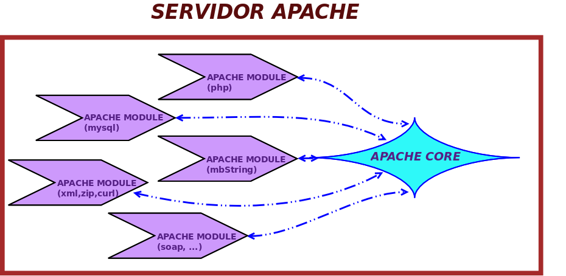
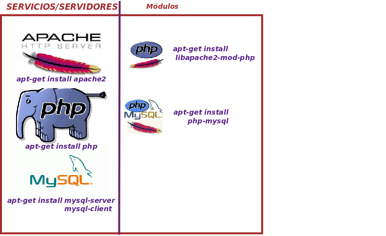
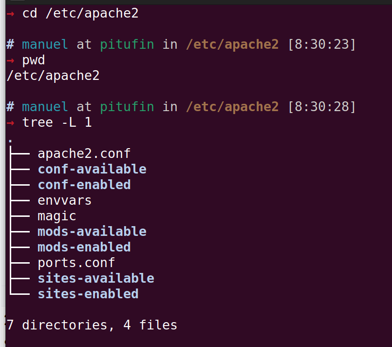

*Servidor web*

### Servidor Apache y su funcionamiento modular



Como se muestra en la imagen, Apache funciona mediante un sistema de módulos.

Cada uno de estos módulos (como **PHP**, **MySQL**, **XML**, entre otros) añade funcionalidades específicas y se conecta al **núcleo de Apache**.

Puedes activar o desactivar, instalar o desinstalar módulos según tus necesidades, manteniendo solo aquellos que sean esenciales.

Es importante recordar que, al instalar Apache, se abre una "puerta" en el sistema hacia redes externas, lo que puede representar una exposición al exterior.

Mantener activos solo los módulos necesarios reduce esta exposición y ayuda a mejorar la seguridad del servidor.

## Consideraciones de seguridad

Cuando instalas y configuras Apache en tu sistema, estás abriendo una "puerta" que permite el acceso desde redes externas. Esto significa que, en cierta medida, tu sistema está expuesto al exterior, lo que podría representar un riesgo de seguridad si no se toman las precauciones adecuadas.

Para minimizar esta exposición, es importante:

- <Color>Mantener actualizados</Color> tanto Apache como sus módulos.
- <Color>Configurar adecuadamente</Color> los permisos y accesos, limitando el acceso a solo aquellos que necesiten interactuar con el servidor.
- <Color>Deshabilitar módulos innecesarios</Color>, ya que cada módulo adicional aumenta las posibles vulnerabilidades.

Recuerda que el uso seguro de Apache es esencial para proteger la infraestructura de red y los datos alojados en el servidor.

### Módulos a instalar



::: tip Instalación en Windows
- En Windows se instala todo instalando el paquete [XAMPP](https://www.apachefriends.org/es/index.html) o [WampServer](https://www.wampserver.com/en/).

- Una vez instalado debes activarlo o arrancar los servicios correspondientes.
:::

### Concepto del virtual host

Ponamos la siguiente analogía:
imaginemos que tenemos una persona llamada Manuel. En el trabajo, le llaman "Manuel" y adopta una actitud profesional y seria. En casa o con amigos, le llaman "Manolo" y su actitud es más relajada y cercana. Aunque es la misma persona, responde de manera diferente según cómo le llamen.


De forma similar, en Apache, <Color>un Virtual Host permite que el mismo servidor web responda de manera distinta según el nombre de dominio o dirección con la que se le acceda</Color>.

Siguiendo con la metáfora, es como si fuera **Manuel** en un contexto y **Manolo** en otro.

Con <Color>Virtual Hosts</Color>, Apache puede manejar varios sitios web en un solo servidor, mostrando diferentes contenidos o configuraciones según el dominio que se utilice.

### Dónde se configura cada Virtual Host

Los ficheros de configuración de Apache están en `/etc/apache2`. En la imagen puedes ver cómo ubicarte y qué ficheros contiene.



Observa los comandos utilizados:

```bash{1}
cd # change directory para cambiar de directorio
pwd # print work directory: ver el directorio actual de trabajo
tree -L 1 # ver el contenido de un directorio con nivel 1 de profundidad con formato arborescente. Nivel 1 es no mostrar los subdirectorios
```

La configuración de los <Color>sitios web</Color> está bajo los directorios <Color>sites-available</Color> y <Color>sites-enabled</Color>.

- Después, para activarlo en <Color>sites-enabled</Color> usando el comando <Color>a2ensite nombre_sitio</Color>. Este comando crea un enlace simbólico que permite poner el sitio en funcionamiento.

#### Cómo crear nombres diferentes para mi máquina

Para tener nombres únicos accesibles desde internet, lo ideal es comprar un dominio en un **ISP** (Proveedor de Servicios de Internet) y configurarlo para que apunte a tu máquina.

Sin embargo, para hacer pruebas en local, puedes modificar el archivo <Color>hosts</Color> en tu equipo.
En Ubuntu este fichero está ubicado en <Color>/etc/hosts</Color>, y en Windows en <Color>c:\windows\system32\drivers\etc\hosts</Color>.

Este archivo permite asignar nombres personalizados a direcciones IP en tu red local.

Por ejemplo, puedes añadir las siguientes líneas al archivo `hosts` para asociar los dominios locales a `localhost`:

```bash{1}
127.0.0.1 www.informatica.com
127.0.0.1 www.musica.com
```

Una vez que hayas agregado el nombre en <Color>hosts</Color>, puedes probar que funciona ejecutando un <Color>`ping`</Color> al nombre que has configurado, como por ejemplo:

```bash{1}
ping www.informatica.com
```

### Directivas a configurar

Apache se configura a través de <Color>directivas</Color>, que son como variables que definen el comportamiento del servidor al cargar el servicio.

Siguiendo con la metáfora anterior de "Manuel" y "Manolo", donde se establecen comportamientos distintos según el contexto, aquí concretaremos esos comportamientos deseados.

Algunas de las directivas más importantes son:

- <Color>ServerName</Color>: define el nombre del servidor o dominio que vamos a asociar a una configuración específica. Esto indica el nombre con el que el servidor responderá.

- <Color>DocumentRoot</Color>: especifica el directorio donde Apache debe buscar los archivos de los recursos. Aquí se encuentra el contenido que será servido a los usuarios cuando accedan al sitio.

Al configurar estas directivas, estamos definiendo cómo se comportará Apache y cómo gestionará las solicitudes para cada sitio web.

::: warning Muy importante
Siempre que modifiquemos alguna directiva de configuración, debemos rebotar el servicio:

```bash{1}
sudo service apache2 restart
```
:::
