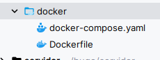
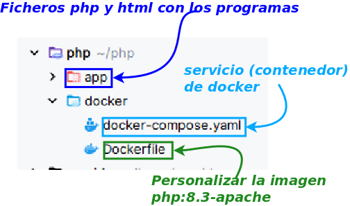
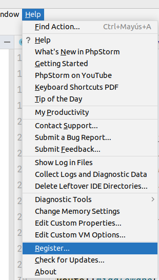
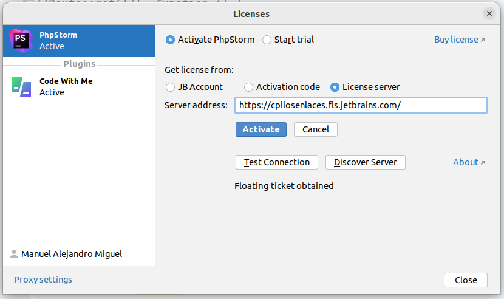
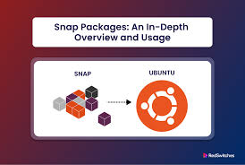

::: pageinfo
La instalación de Apache, PHP, XAMPP y Docker está en [Herramientas](/02_entornos_herramientas/instalaciones/). Esta página concentra **PhpStorm**, la **licencia del instituto** y los **permisos de Linux** para Apache.
:::

## Instalando en Ubuntu

* En un sistema Ubuntu, puedes instalar Apache y PHP utilizando los siguientes comandos:

<Color>Actualizar los repositorios:</Color>

```php{1}
#Actualizar repositorios
sudo apt update
#Instalar Apache2
sudo apt install apache2
#Instalar php y el módulo de php para apache 
sudo apt install php libapache2-mod-php
```
Depué de realizar estas tareas, debes de resetear apache para ponerlo todo en funcionamiento
```php{1}
sudo systemctl restart apache2
```

## Instalando en Windows con XAMPP

XAMPP es una solución sencilla para tener Apache, PHP, y MySQL en Windows. Sigue estos pasos para instalarlo:

<Color>Descargar XAMPP</Color>
Ve al sitio web oficial de XAMPP [https://www.apachefriends.org](https://www.apachefriends.org) y descarga la versión que incluye PHP.

<Color>Instalar XAMPP</Color>
Ejecuta el instalador y sigue las instrucciones. Asegúrate de seleccionar Apache y PHP durante la instalación.

<Color>Iniciar los servicios</Color>:
Abre el panel de control de XAMPP y asegúrate de iniciar Apache.

<Color>Comprobar instalación</Color>
Abre tu navegador y visita `http://localhost/`. Deberías ver la página de bienvenida de XAMPP.

## Creación de docker

::: pageinfo
La semana de clase (imagen, comandos, compose) está en [Docker](/02_entornos_herramientas/docker/00_index). Aquí se repite el recorte de ficheros para PhpStorm y permisos.
:::

* Es esta la solución que vamos a utilizar.
* Para ello crearemos un <Color>docker-compose.yaml</Color>, que nos levante un servicio con php y apache2.
* Por si queremos realizar modificaciones sobre la imagen original, la imagen la vamos a crear a patir de un <Color>Dockerfile</Color>
* Cada proyecto que creemos o bien tendremos esta estructura, o bien los crearemos todos a partir de la carpeta compartida
 



---
  

El contenido de los ficheros:

```docker{2,3,4,5,8}
services:
    web:
        build : .
        ports:
            - 8800:80
        volumes:
            - ./../app:/var/www/html
        container_name: web
```

::: warning Info
* Creamos el servicio (contenedor ) ***web***
* A partir del **Dockerfile** que tenemos en **la misma carpeta**
* Proyectamos el puerto **8800** para acceder a él
* Mapeamos la carpeta **./../app** para escribir nuestros programas
:::


El Dockerfile 
```php{1}
#Usa la imagen base de PHP con Apache
FROM php:8.3-apache
ENV DEBIAN_FRONTEND=noninteractive
RUN apt update
***Añadir o modificar la configuración de Apache para listar directorios si no hay index***
RUN echo '<Directory /var/www/html>' >> /etc/apache2/apache2.conf
RUN echo 'Options +Indexes' >> /etc/apache2/apache2.conf
RUN echo '</Directory>' >> /etc/apache2/apache2.conf


# Exponer el puerto 80 Algo recomendado, aunque no nodecesrio
EXPOSE 80
```

La imagen de la estructura la podríamos organizar de la siguiente manera


# Instalación de PhpStorm

Vamos a usar esta herramienta y se os facilitarán claves para acceder. Puedes descargarla desde el sitio oficial:

::: referencias Enlaces para Windows y Linux
- <https://www.jetbrains.com/es-es/phpstorm/download/>
:::


::: warning Nota Importante
Debemos registrarnos en JetBrains con una cuenta de Gmail. Inicialmente, podemos usar el acceso gratuito de 30 días.
:::


## Instalación  de phpstorm
::: definicion ¿Qué es PhpStorm?
- PhpStorm es un entorno de desarrollo integrado (IDE) diseñado específicamente para el desarrollo en PHP. Ofrece herramientas avanzadas como depuración, soporte para frameworks, integración con control de versiones y edición de HTML, CSS y JavaScript, todo en una interfaz intuitiva.
:::


### Instalación en ubuntu

<Color>PhpStorm se puede instalar fácilmente en sistemas Ubuntu utilizando Snap.</Color> Snap es un sistema de paquetes que resuelve problemas de dependencias y simplifica las instalaciones en Ubuntu (introducido desde la versión 16.04).


---


<Color>Instalación mediante Snap</Color>

1. Asegúrate de tener Snap habilitado. Para más información sobre Snap, consulta:
   ::: referencias Guía básica
- <https://blogubuntu.com/que-es-ubuntu-snap>
:::


2. Ejecuta el siguiente comando para instalar PhpStorm:
   ```dockerfile{1}
   sudo snap install phpstorm --classic
```

<Color>Instalación manual</Color>

Si prefieres instalar PhpStorm manualmente:

1. Descarga el archivo desde el sitio oficial:
   ```dockerfile
   wget https://download.jetbrains.com/webide/PhpStorm-2020.2.2.tar.gz
```

2. Extrae el contenido en el directorio recomendado `/opt`:
   ```dockerfile
   sudo tar xvfz PhpStorm-2020.2.2.tar.gz -C /opt/
```
   ::: definicion Parámetros del comando tar
- **x**: Extraer archivos.
- **f**: Utilizar un archivo.
- **z**: Operar sobre un archivo comprimido gzip.
- **v**: Mostrar las acciones de forma detallada (verbose).
:::


3. Cambia al directorio de instalación y ejecuta el script:
   ```dockerfile
   cd /opt/PhpStorm-181.5281.19/bin
   ./phpstorm.sh
```

#### Instalación en Windows

1. Visita la página de descarga:
   ::: referencias Instalación guiada
- <https://www.jetbrains.com/es-es/phpstorm/download/#section=windows>
:::


2. Descarga y ejecuta el instalador siguiendo los pasos indicados.


---


#### Activar la licencia de phpstorm a través del instituto

Abrimos el <Color>IDE PhpStorm</Color>. Si es la primera vez, se nos pedirá que aportemos la licencia o que iniciemos la versión gratuita de 30 días. Si ya hemos iniciado previamente, podemos acceder al registro desde el menú **Help**.


1. Se visualizará una página para activar la licencia.
2. Seleccionamos la opción de activación mediante servidor de licencias.

 
3. Establecemos la siguiente URL del servidor:  
   ```dockerfile{1}
   https://cpilosenlaces.fls.jetbrains.com
```

4. Finalmente, presionamos la opción **Activate** para completar el proceso.

::: details ¿Por qué usar Snap para instalar PhpStorm?


*Snap resuelve problemas de dependencias y ofrece una instalación rápida y segura, ideal para mantener PhpStorm actualizado automáticamente.*
:::


::: info Nota adicional
Si tienes alguna duda, consulta la sección de preguntas frecuentes de JetBrains o contacta al soporte.
:::


### Temas de permisos de **Apache**

A pesar de que no somos administradores/as, debemos tener conocimientos sobre ciertos temas.  
Lo primero que debemos tener claro es que cuando **PHP** le dice en el script a Apache que actúe sobre el sistema de ficheros, en última instancia, es el usuario **apache** quien ejecuta las acciones.

Lee atentamente el siguiente cuadro y asegúrate de entender cada punto; si no, pregunta.

#### Puntos fundamentales sobre permisos

1. En **Linux**, todo **fichero** tiene un **propietario**, y también todo **proceso** o **aplicación**, como lo es <Color>el servidor web apache</Color>.
    - El **propietario** del proceso es el **usuario que lanzó** dicho proceso.
    - Cuando un proceso quiere actuar sobre un fichero, el usuario que lo lanzó debe tener **permisos sobre el fichero**.
    - El usuario que lanza el programa o servicio **Apache** es **www-data**.
    - Para cambiar el propietario de un fichero o su grupo, usamos la siguiente sentencia:

   ```php{1}
   sudo chown usuario:grupo fichero (-R)
```

   **Nota**: El parámetro `-R` es opcional y actúa de forma recursiva.

2. En PHP, un **directorio es igual que un fichero** cuyo contenido son los ficheros y directorios que contiene.

#### Para dar permisos sobre un fichero a un usuario

Usamos la siguiente sentencia:

```php{1}
sudo chmod permisos fichero (-R)
```

**Nota**:
- **permisos** es un número de tres dígitos en **octal** (ver tabla abajo).
- **fichero** es el archivo al cual queremos asignar permisos; se puede usar `*` para aplicar a todos.
- `-R` es un parámetro opcional que actúa de forma recursiva.

| Número | Binario | Lectura (r) | Escritura (w) | Ejecución (x) |
| ------ | ------- | ----------- | ------------- | ------------- |
| 0      | 000     | ❌          | ❌            | ❌            |
| 1      | 001     | ❌          | ❌            | ✔️            |
| 2      | 010     | ❌          | ✔️            | ❌            |
| 3      | 011     | ❌          | ✔️            | ✔️            |
| 4      | 100     | ✔️          | ❌            | ❌            |
| 5      | 101     | ✔️          | ❌            | ✔️            |
| 6      | 110     | ✔️          | ✔️            | ❌            |
| 7      | 111     | ✔️          | ✔️            | ✔️            |

Por ejemplo:

```php{1}
chmod 766 file.txt   # Brinda acceso total al dueño, y lectura y escritura a los demás
chmod 770 file.txt   # Brinda acceso total al dueño y al grupo, y elimina permisos a los demás
chmod 635 file.txt   # Permite lectura y escritura al dueño, escritura y ejecución al grupo, y lectura y ejecución al resto
```

> **Nota**: Recuerda que es el usuario **apache** quien debe tener los permisos necesarios (**leer (r), escribir (w), ejecutar (x)**).

#### Establecer propietaro a carpetas

El comando <Color>chown</Color> en Linux, permite <Color>cambiar el propietario y el grupo de uno o varios archivos o directorios</Color>. 

```bash{1}
    sudo chown usuario:grupo archivo_o_directorio
```

* <Color>Usuario</Color> se refiere al nuevo propietario del archivo o directorio.
* <Color>grupo</Color> es el grupo al que se le asignarán los permisos sobre ese archivo o directorio. 
* Al añadir el parámetro <Color>-R</Color> al comando, <Color>chown</Color> aplica el cambio de propietario y grupo de manera recursiva, afectando todos los archivos y carpetas dentro del directorio especificado.


Para el caso de servidores web, el directorio <Color>/var/www/html</Color> es donde suelen almacenarse los archivos públicos del sitio (valor que contiene la directiva <Color>DocumentRoot</Color> en la configuración del virtual host del servidor.

<Color>El propietario</Color> de este directorio debería ser <Color>el usuario del sistema</Color> que necesita subir o modificar los archivos.

<Color>El grupo</Color> debería asignarse al usuario que ejecuta Apache <Color>(generalmente `www-data`)</Color>

 Esto permite que el sistema gestione los archivos correctamente

::: tip Importante
* El usuario del sistema tiene permisos de escritura para crear, modificar o eliminar archivos según sea necesario.
* El grupo de Apache (`www-data`) puede acceder a los archivos para servirlos a través del servidor web.
:::


Para establecer este tipo de permisos en `/var/www/html`, puedes ejecutar:

```php{1}
sudo chown usuario:www-data /var/www/html -R
```

Con esta configuración, los archivos se gestionarán con permisos de usuario para editar contenido y permisos de grupo para que Apache pueda acceder y servir el sitio web de manera segura.
