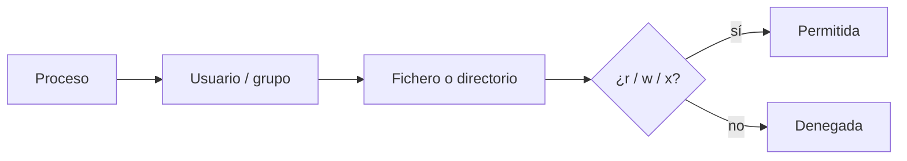

::: objetivos Chuleta de los comandos que usaremos en clase
- Moverte en un terminal,  por el sistema de archivos sin perderte (saber dónde estamos, y como movernos a otra ubicación)
- Crear, copiar, ver y buscar ficheros
- Permisos justos, pe. `/var/www` (importante asignarlo al recurso (carpeta/s-directorio/s que queremos, cuidado con no hacerlo en otro recurso)
- Entender qué hace `apt update` / `apt install` cuando falta un comando
- Estos comandos los usaremos y reapareceran con  Docker, Apache, se intentará referenciar aquí. En despliegue los estudiaréis con detalle.
:::

::: pageinfo
Guía de consulta, no un tema de Linux.

Cada ficha trae **comando**, **origen** (letras marcadas), **una frase**, **un ejemplo** y solo las opciones que vamos a usar. También se aportarán ejemplos

Es un documento de **lectura fácil**
:::

::: tip `command not found`
Es posible que a veces Ubuntu, nos  responda esto,

En este caso habrá que **instalarlo** para poderlo utilizar

También puede ser que no esté en el **PATH** y haya que incluirlo (veremos cómo hacerlo)
:::

## Rutas que vas a repetir

::: definicion Dónde estás
- `/` raíz del sistema
- `~` tu home (`/home/tu-usuario`)
- `.` directorio actual
- `..` directorio padre
:::


## Gestión de Paquetes o programas

## Gestión de paquetes o programas
<CmdPane>
<Cmd wide name="apt" mne="*a*dvanced *p*ackage *t*ool · gestión de paquetes" example="sudo apt update">
  Actualiza la información de lo que hay en los <strong>repositorios</strong> (nombres y versiones).
  No instala programas.
</Cmd>
</CmdPane>


Ubuntu **no descarga programas al azar**. Instala **paquetes** que saca de **repositorios**: almacenes de software ya preparado para esta distribución.

::: definicion Repositorio de paquetes
Una fuente configurada en el sistema de la que `apt` puede instalar, actualizar o consultar software. Los **repositorios oficiales de Ubuntu** son los que trae de serie (lo habitual en clase).

Se pueden añadir repositorios de otros proveedores de software
:::

La lista de repositorios no es mágica: está en ficheros de configuración.

- Clásico: `/etc/apt/sources.list`
- Ubuntu actual: sobre todo `/etc/apt/sources.list.d/` (a veces un `ubuntu.sources`)

No hace falta editarlos a mano ahora. Sí hace falta distinguir dos comandos que se copian juntos y **no hacen lo mismo**:

<CmdPane>
<Cmd name="apt update" mne="*a*dvanced *p*ackage *t*ool · actualizar catálogo" example="sudo apt update">

Actualiza la **información** de lo que hay en los repositorios (nombres y versiones). **No instala** programas.

</Cmd>

<Cmd name="apt install" mne="*a*dvanced *p*ackage *t*ool · instalar" example="sudo apt install tree">

Instala un paquete usando ese catálogo. Si el catálogo está viejo, puede que no vea la versión actual: por eso suele ir **después** de `update`.

</Cmd>
</CmdPane>

```bash
sudo apt update
sudo apt install tree
```

::: info Repositorios externos
A veces el software que necesitamos **no está** (o no en la versión que queremos) en los repositorios configurados por defecto. Entonces se añade un repositorio **externo**.

En este módulo aparecerá con calma, por ejemplo al instalar **ciertas versiones de PHP** o al preparar **Docker**. De momento basta con saber que existe: `apt` solo instala lo que sus repositorios conocen.
:::

## Navegación

<CmdPane>
<Cmd name="pwd" mne="*p*rint *w*orking *d*irectory" example="pwd">

Imprime el directorio de trabajo: **dónde estás**.

</Cmd>

<Cmd name="cd" mne="*c*hange *d*irectory" example="cd /var/www/html">

Cambia de directorio.

- `cd ..` sube al padre
- `cd ~` o `cd` → home
- `cd -` vuelve al anterior
- `cd /` va a la raíz

</Cmd>

<Cmd name="ls" mne="*l*i*s*t" example="ls -la /var/www/html">

Lista el contenido del directorio.

- `-l` detalle (permisos, dueño, tamaño)
- `-a` incluye ocultos (`.env`, `.git`)
- `-h` tamaños legibles (`2.4K` en vez de bytes)

</Cmd>

<Cmd name="tree" mne="tree (árbol)" pkg="tree" example="tree -L 2 /etc/apache2">

Muestra el directorio en árbol. Muy útil para ver `sites-available` / `sites-enabled`.

- `-L n` profundidad máxima

</Cmd>
</CmdPane>

## Crear, copiar, mover, borrar

<CmdPane>
<Cmd name="mkdir" mne="*m*a*k*e *dir*ectory" example="mkdir -p app/public">

Crea un directorio.

- `-p` crea también los padres si no existen (no falla si ya está)

</Cmd>

<Cmd name="touch" mne="touch" example="touch index.php">

Crea un fichero vacío. Si ya existe, solo le actualiza la fecha.

</Cmd>

<Cmd name="cp" mne="*c*o*p*y" example="sudo cp 000-default.conf informatica.conf">

Copia ficheros. El original se queda.

- `-r` recursivo (obligatorio para directorios)

</Cmd>

<Cmd name="mv" mne="*m*o*v*e" example="mv prueba.php app/public/">

Mueve o **renombra**. No hay comando `rename` (mv sería su equivalente).

</Cmd>

<Cmd name="rm" mne="*r*e*m*ove" example="rm -i cache.tmp">

Borra. **No hay papelera.**

- `-r` borra directorios
- `-i` pregunta antes
- `-rf` fuerza y recursivo: no lo uses en `/` ni “por si acaso”

</Cmd>

<Cmd name="ln" mne="*l*i*n*k" example="ln -s /var/www/html html">

Crea un enlace. Con `-s` es **simbólico** (un atajo a otra ruta). Por ejemplo, `a2ensite` internamente hace esto entre `sites-available` y `sites-enabled`.

- `-s` simbólico (el que usamos)

</Cmd>
</CmdPane>

::: danger `rm -rf`
Cuidado al utilizar este comando. <strong>borramos lo especificado de forma  recursiva y sin preguntar</strong>.
:::

## Ver y editar

<CmdPane>
<Cmd name="cat" mne="*cat*enate (concatenar)" example="cat /etc/hosts">

Vuelca el fichero entero en la terminal. Para ficheros **cortos**.

</Cmd>

<Cmd name="less" mne="less is more" example="less /var/log/apache2/error.log">

Paginador: lees un fichero largo sin abrirlo en un editor.

- `q` salir
- `/texto` buscar
- flechas / espacio para moverte

</Cmd>

<Cmd name="head" mne="head (cabeza)" example="head -n 20 index.php">

Primeras líneas.

- `-n` cuántas líneas (por defecto 10)

</Cmd>

<Cmd name="tail" mne="tail (cola)" example="tail -f /var/log/apache2/error.log">

Últimas líneas. Imprescindible con logs.

- `-n` cuántas líneas
- `-f` *follow*: se queda mirando lo nuevo (Ctrl+C para salir)

</Cmd>

<Cmd name="nano" mne="nano" example="nano .env">

Editor sencillo en terminal. Ctrl+O guardar, Ctrl+X salir. Con `sudo nano` editas ficheros de sistema (`/etc/hosts`, virtual hosts).

</Cmd>
</CmdPane>

## Búsqueda

<CmdPane>
<Cmd name="grep" mne="*g*lobal *r*egular *e*xpression *p*rint" example="grep -Rl 'mysqli' /var/www/html">
  Busca texto **dentro** de ficheros.
  - `-i` ignora mayúsculas
  - `-n` número de línea
  - `-r` / `-R` recursivo en carpetas
  - `-l` solo el **nombre del fichero** que contiene la coincidencia
</Cmd>


<Cmd name="find" mne="find" example="find /var/www/html -name '*.php'">

Busca **ficheros** por nombre, tipo o ruta (no el contenido).

- `-name '*.php'` patrón (las comillas evitan que la shell expanda el `*`)
- `-type d` solo directorios · `-type f` solo ficheros

</Cmd>

<Cmd name="which" mne="which" example="which php">

Ruta del ejecutable que se lanzaría. Sirve para comprobar que existen `php`, `docker` o `composer`.

</Cmd>
</CmdPane>

## Permisos y usuarios

En Linux **todo proceso corre asociado a un usuario**. En este nivel: el que lo ha lanzado. Más adelante veremos servicios que cambian de usuario o arrancan con uno concreto.

Cuando ese proceso toca un fichero o directorio, el sistema no pregunta “¿quién soy yo en la terminal?”: mira el **usuario/grupo del proceso** y los **permisos del recurso**.

::: definicion El modelo
proceso → usuario/grupo → recurso → permisos → operación permitida o denegada
:::



Tres permisos:

| | En un **fichero** | En un **directorio** |
| --- | --- | --- |
| `r` read | leer el contenido | listar (`ls`) |
| `w` write | modificarlo | crear, borrar o renombrar entradas |
| `x` execute | ejecutarlo | **entrar** (`cd`) |

En un directorio, `r` y `w` casi siempre van con `x`: sin `x` no entras, y entonces no puedes listar ni crear nada útil.

En este módulo, Apache/PHP suele ejecutarse como `www-data`. Si PHP no puede leer o escribir, el que choca con los permisos es **ese** proceso, no tu usuario de clase. Detalle y tabla octal → [PhpStorm y permisos](/02_entornos_herramientas/instalaciones/phpstorm).

<CmdPane>
<Cmd name="sudo" mne="*s*uper*u*ser *do*" example="sudo nano /etc/hosts">

Ejecuta el comando como administrador. Lo pide el sistema cuando tocas `/etc`, paquetes o servicios.

</Cmd>

<Cmd name="whoami" mne="*who am i*" example="whoami">

Qué usuario eres **en esta terminal**. Dentro de un contenedor a menudo es `root`; en tu Ubuntu, tu cuenta.

</Cmd>

<Cmd name="chmod" mne="*ch*ange *mod*e" example="chmod 755 public">

Cambia **permisos** (qué se puede leer, escribir o ejecutar).

- `-R` recursivo
- `+x` dar ejecución (scripts)
- `644` fichero típico · `755` directorio / script

</Cmd>

<Cmd name="chown" mne="*ch*ange *own*er" example="sudo chown -R $USER:www-data /var/www/html">

Cambia **propietario y grupo**. Formato `usuario:grupo`.

- `-R` recursivo
- El grupo `www-data` es el de Apache

</Cmd>
</CmdPane>

::: warning No uses `chmod 777` “para que vaya”
Abre el fichero a todo el mundo. En clase se ve al momento; en un servidor es un agujero. Ajusta dueño (`chown`) y un `755`/`644`.
:::

## Procesos y servicios

<CmdPane>
<Cmd name="ps" mne="*p*rocess *s*tatus" example="ps aux | grep apache">

Lista procesos. `aux` es el retrato amplio (usuario, CPU, comando).

</Cmd>

<Cmd name="top" mne="top (los de arriba)" example="top">

Vista en vivo de CPU y memoria. `q` para salir. Si un contenedor se come la RAM, empieza aquí.

</Cmd>

<Cmd name="kill" mne="kill" example="kill 1234">

Pide a un proceso (por PID, columna de `ps`/`top`) que termine.

- `-9` forzar (*SIGKILL*): último recurso, no el primer intento

</Cmd>

<Cmd name="systemctl" mne="systemd control" example="sudo systemctl restart apache2">

Controla **servicios** (Apache, MySQL, Docker…). Es el comando nativo en Ubuntu.

- `status` · `start` · `stop` · `restart` · `reload`
- `reload` recarga config sin tumbar del todo (Apache, después de un virtual host)
- Atajo equivalente: `sudo service apache2 restart` (en Debian/Ubuntu acaba llamando a `systemctl`)

</Cmd>
</CmdPane>

## Red

<CmdPane>
<Cmd name="ping" mne="ping" example="ping -c 4 127.0.0.1">

¿Hay red hasta esa máquina? También comprueba que un nombre de `/etc/hosts` resuelve.

- `-c 4` solo 4 paquetes (si no, no para hasta Ctrl+C)

</Cmd>

<Cmd name="curl" mne="*c*lient *URL*" pkg="curl" example="curl -I http://localhost:8800">

Habla HTTP desde la terminal: tu PHP, Laravel o el contenedor.

- `-I` solo cabeceras (¿responde 200, 301, 500?)
- `-L` sigue redirecciones

</Cmd>

<Cmd name="ss" mne="*s*ocket *s*tatistics" example="ss -tuln">

Puertos a la escucha. Busca `:80`, `:8800`, `:3306`, `:443`.

- `-t` TCP · `-u` UDP · `-l` listening · `-n` números, sin resolver nombres

</Cmd>

<Cmd name="ip" mne="*IP*" example="ip -br a">

Direcciones de tus interfaces.

- `a` (*address*) todas
- `-br` formato corto, el que se puede leer en clase

</Cmd>
</CmdPane>

## Disco

<CmdPane>
<Cmd name="df" mne="*d*isk *f*ilesystem" example="df -h">

Espacio de las **particiones** (el disco visto por el sistema).

- `-h` tamaños humanos (`G`, `M`)

</Cmd>

<Cmd name="du" mne="*d*isk *u*sage" example="du -sh /var/www/html">

Peso de **una carpeta** (vendor, node_modules, logs…).

- `-s` solo el total · `-h` legible
- `du -sh *` totales de cada entrada del directorio actual

</Cmd>
</CmdPane>

## Empaquetar: `tar`

<CmdPane>
<Cmd name="tar" mne="*t*ape *ar*chive" example="tar -czf proyecto.tar.gz app/">

Empaqueta (y casi siempre comprime) un directorio. Lo contrario: descomprimir.

- `-c` crear · `-x` extraer · `-f` fichero
- `-z` gzip (por eso ves `.tar.gz`)
- Extraer: `tar -xzf proyecto.tar.gz`

</Cmd>
</CmdPane>

## Atajos de terminal

No son comandos de paquete, pero ahorran más tiempo que media chuleta.

| Qué | Para qué |
| --- | --- |
| `Tab` | Autocompleta rutas y comandos |
| `↑` / `↓` | Recorre el historial |
| `Ctrl+C` | Corta el proceso en primer plano (`ping`, `tail -f`, `top`) |
| `Ctrl+L` o `clear` | Limpia la pantalla |
| `Ctrl+D` | Fin de entrada / salir de algunas shells |

<CmdPane>
<Cmd name="history" mne="history" example="history | tail">

Lista los comandos que ya has usado. `!210` repite el número 210 (con cuidado).

</Cmd>

<Cmd name="man" mne="*man*ual" example="man ls">

Manual del comando. `q` sale. Versión rápida: `ls --help`.

</Cmd>

<Cmd name="echo" mne="echo" example="echo $USER">

Imprime texto o el valor de una **variable**. En Docker y Laravel verás mucho `$VAR` y ficheros `.env`.

</Cmd>
</CmdPane>

| Símbolo | Qué hace | Ejemplo |
| --- | --- | --- |
| `\|` | Tubería: la salida de uno entra en el siguiente | `ps aux \| grep apache` |
| `>` | Escribe / **sobrescribe** un fichero | `echo hola > nota.txt` |
| `>>` | **Añade** al final | `echo otra >> nota.txt` |
| `&&` | Encadena si lo anterior fue bien | `mkdir app && cd app` |

## Con Docker

Estos comandos **no** vienen con Ubuntu: hace falta el motor de Docker (unidad [Docker](../02_docker/index.md)). La idea clave: `docker exec … bash` te deja **dentro** de un Linux; a partir de ahí valen `ls`, `cd`, `chmod`, `tail`…

<CmdPane>
<Cmd name="docker exec" mne="*exec*ute (ejecutar dentro)" example="docker exec -it web bash">

Abre una shell en un contenedor que **ya está en marcha**. `-it` es interactivo + terminal. `web` es el `container_name` de clase.

</Cmd>

<Cmd name="docker compose ps" mne="compose · process status" example="docker compose ps">

Estado de los servicios del `compose` (¿está `up` el `web`?).

</Cmd>

<Cmd name="docker compose logs" mne="compose · logs" example="docker compose logs -f">

Logs del compose. `-f` es el `tail -f` de Docker.

</Cmd>

<Cmd name="docker compose up" mne="compose · up / down" example="docker compose up -d">

Levanta el laboratorio. `-d` en segundo plano (*detached*). Para tumbarlo: `docker compose down`.

</Cmd>
</CmdPane>

## Apache (los de la práctica)

Van con el paquete `apache2`. Tras cambiar un virtual host: `sudo systemctl reload apache2`.

<CmdPane>
<Cmd name="a2ensite" mne="apache2 enable site" need="Va con Apache (sudo apt install apache2)." example="sudo a2ensite informatica.conf">

Activa un virtual host: crea el enlace en `sites-enabled`. El contrario es `a2dissite`.

</Cmd>

<Cmd name="apache2ctl" mne="apache2 control" need="Va con Apache (sudo apt install apache2)." example="sudo apache2ctl configtest">

`configtest` revisa la configuración **antes** del reload. Si dice `Syntax OK`, recarga; si no, no tumbes Apache a ciegas.

</Cmd>
</CmdPane>

::: referencias Dónde sigue esto
- [PhpStorm y permisos](/02_entornos_herramientas/instalaciones/phpstorm) — `chmod`, `chown`, `www-data`
- [Apache](/02_entornos_herramientas/instalaciones/apache/) y [práctica de virtual hosts](/02_entornos_herramientas/instalaciones/apache/practica/)
- [Docker](../02_docker/index.md) — imagen, contenedor, volumen, compose
:::

## Apache

En este módulo vas a vivir aquí:

- `/var/www/html` — código que sirve Apache (en Docker, el volumen del proyecto)
- `/etc/apache2` — configuración de Apache
- `/etc/hosts` — nombres locales (`www.informatica.com` → `127.0.0.1`)
- `/var/log/apache2` — logs del servidor web
