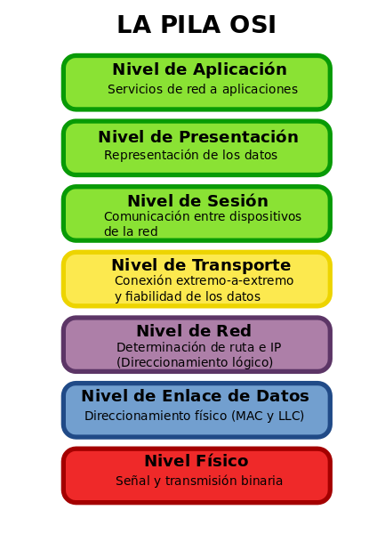
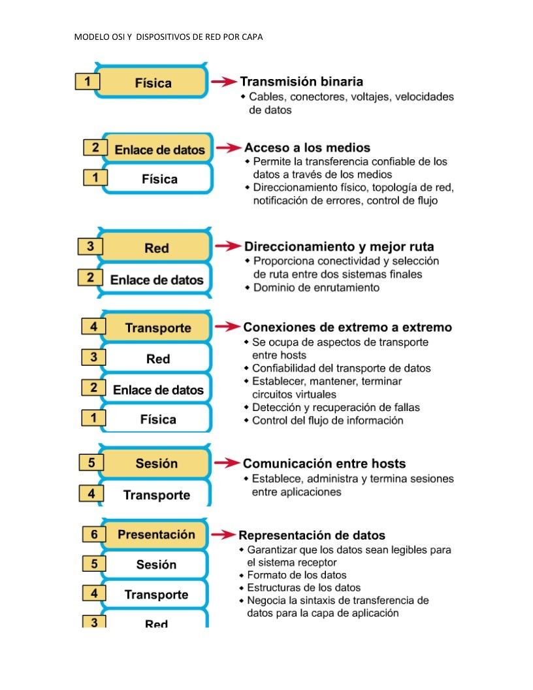
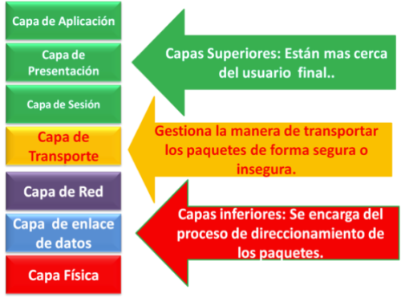
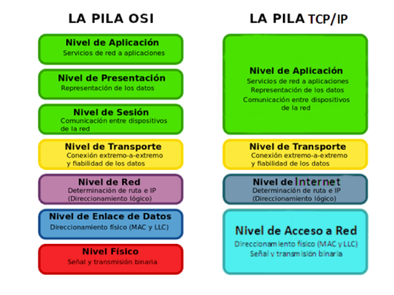
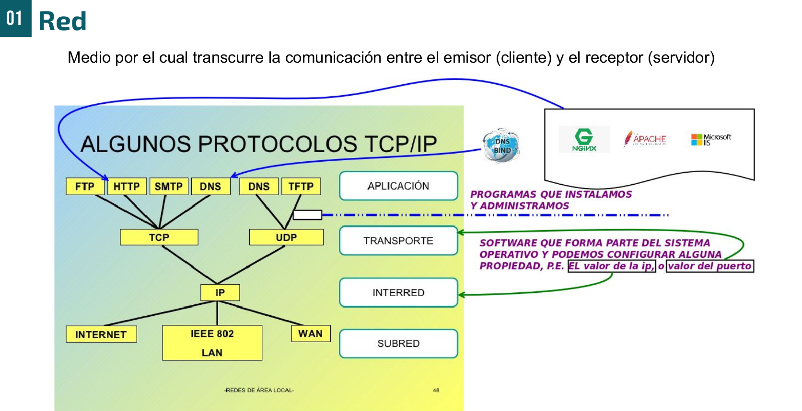
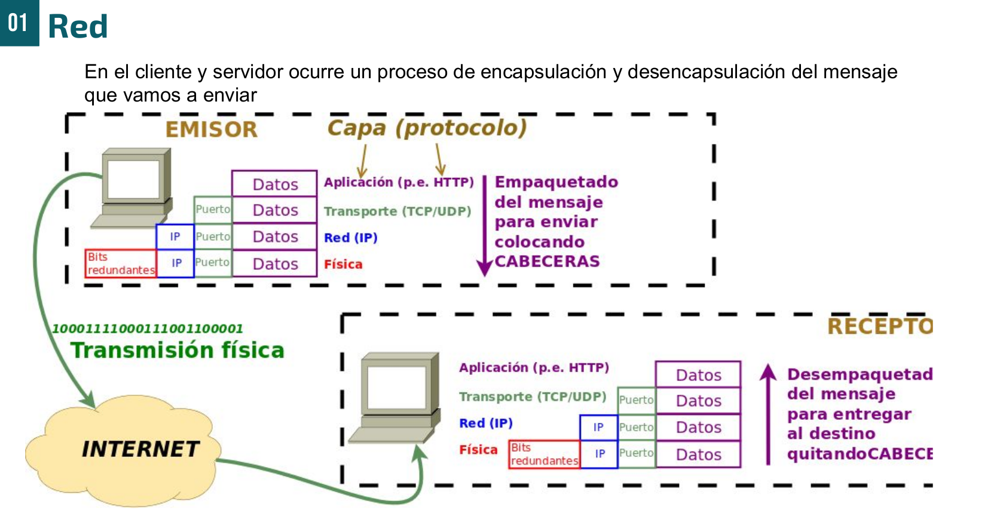

::: objetivos
- Modelo OSI
- Modelo TCP/IP
- Concepto de protocolo
- Proceso de comunicación extremo a extremo
:::

## Introducción al Modelo OSI

El <Color>modelo OSI</Color> (Open Systems Interconnection) es un marco conceptual (es la base para la construcción y definición de redes), que define <Color>cómo las aplicaciones en una red pueden comunicarse entre sí.</Color>

Fue desarrollado por la <Color>ISO (Organización Internacional de Normalización)</Color> en 1984 para estandarizar las funciones de comunicación de los sistemas de red.

El modelo OSI se divide en <Color>siete capas</Color>, cada una de las cuales describe una parte específica del proceso de comunicación.

Estas capas van desde el <Color>nivel físico</Color>, donde se produce la transferencia física de bits a través de señales eléctricas o inalámbricas, hasta las <Color>aplicaciones de usuario</Color>, facilitando la comunicación entre distintos sistemas y aplicaciones de red.

Las siete capas son:

1. **Capa Física**
2. **Capa de Enlace de Datos**
3. **Capa de Red**
4. **Capa de Transporte**
5. **Capa de Sesión**
6. **Capa de Presentación**
7. **Capa de Aplicación**

El modelo OSI es fundamental para entender cómo las redes organizan y gestionan las comunicaciones entre dispositivos.

La idea es que cada capa de diferentes dispositivos se comuniquen de forma directa a través de lo que es el protocolo.

El modelo OSI es una especificación formal y en él se basan la construcción de redes reales como conjunto de protocolos que permiten la comunicación.

Una red real, que todos conocemos, es la red TCP/IP o red de internet.

[Modelo OSI y dispositivos de red por capa](https://www.lawebdelprogramador.com/pdf/15788-Modelo-OSI-y-dispositivos-de-red-por-capa.html)

---

La siguiente imagen muestra la responsabilidad de capas agrupadas, que constituirán una sola capa en el modelo real de la red de internet o TCP/IP.

[Capas en los protocolos](https://domoticaparatodos.com/2016/11/capas-en-los-protocolos/)

De forma ilustrativa, la siguiente imagen muestra la relación de capa/s OSI con las capas de la red de tipo TCP/IP.

### Protocolos

#### ¿Qué es un protocolo?

Un **protocolo** es un conjunto de **reglas** que permite que dos dispositivos diferentes puedan intercambiar **datos**, no información, de manera que ambos dispositivos se **entiendan**. Estas reglas aseguran que la comunicación entre los dispositivos sea **lógica** y de **extremo a extremo**, es decir, desde el origen hasta el destino sin perder coherencia en el proceso.

#### Protocolo como software

Un protocolo no es un concepto abstracto, se materializa en un **software** o **programa** que implementa estas reglas, permitiendo que la comunicación se lleve a cabo.

Los **protocolos de nivel superior** (como los de la capa de aplicación) se materializan en programas que el usuario o el administrador pueden instalar y configurar como un **servicio** o **servidor** en un equipo, que generalmente se denomina **servidor** y suele ser más potente que un equipo normal.

#### Protocolos y el sistema operativo

Los **protocolos de nivel inferior** (capa de sesión, red, enlace-físico) forman parte del **sistema operativo** y se instalan automáticamente con él. Esto sucedió por primera vez en una distribución de **Unix** desarrollada por la Universidad de **Berkeley**, que integró de manera nativa estos protocolos en el sistema.

<Color>El Unix de Berkeley (BSD)</Color> integró <Color>los protocolos TCP/IP de forma nativa en 1983</Color>, lo que contribuyó de manera significativa a la expansión de las redes de computadoras y, eventualmente, de Internet.

---

La siguiente imagen muestra las capas de nivel de una red de internet de tipo TCP/IP.

## Proceso de comunicación

Analiza la siguiente imagen para concretar cómo se produce una comunicación lógica de información a nivel de capas y la comunicación física o intercambio de datos a nivel lógico.

## Proceso de comunicación en redes

Para que se produzca una **comunicación lógica de extremo a extremo** en los diferentes niveles o capas, cada **protocolo** incluye (cuando se encapsula en el emisor) o extrae y analiza (cuando desencapsula en recepción o destino), añadiendo a los datos una **cabecera** o información correspondiente al nivel en el que se encuentra.

### Proceso de comunicación

El proceso de encapsulación y desencapsulación sigue una serie de pasos que involucran diferentes capas del modelo OSI y TCP/IP.

#### En el emisor

1. **Nivel de Aplicación**:
   En la capa de aplicación, los datos que el usuario quiere enviar se procesan según el protocolo de la aplicación (HTTP, FTP, SMTP, etc.). Aquí, se trocea la información (habitualmente llamada **datos o mensaje**), que se pasa al nivel de transporte.

2. **Nivel de Transporte**:
   En esta capa, el protocolo de transporte (TCP o UDP) añade una **cabecera** a cada trozo de datos, que se denomina **segmento** (en el caso de TCP) o **datagrama** (en el caso de UDP). Esta cabecera incluye, entre otras cosas, el **número de puerto**, que es un identificador único que permite saber qué aplicación en el dispositivo de destino debe recibir los datos.

    - **TCP** es un protocolo orientado a la conexión que asegura la entrega fiable de los datos.
    - **UDP** es un protocolo no orientado a la conexión, que ofrece una entrega más rápida pero sin garantías de fiabilidad.

3. **Nivel de Red**:
   El nivel de red utiliza el protocolo **IP** para realizar el enrutamiento de los datos. En este nivel, los **segmentos** de la capa de transporte se encapsulan en **paquetes IP**. La cabecera de IP contiene información clave, como la **dirección IP de origen y destino**, lo que permite a los routers dirigir el paquete al dispositivo correcto.

   Es importante destacar que para **IP**, todo lo que recibe de la capa de transporte, incluidos los datos y las cabeceras de TCP o UDP, es tratado como una unidad de datos. Cada nivel del modelo nunca accede al contenido interno de los datos, solo manipula y analiza su propia cabecera.

4. **Nivel de Enlace**:
   En el nivel de enlace, los **paquetes** de IP se encapsulan en **tramas**. La cabecera de una trama contiene información como las **direcciones MAC** (que identifican de forma única a los dispositivos dentro de la red local). Además, la trama incluye mecanismos de control de errores, como bits de redundancia para detectar y corregir errores. Un protocolo como **Hamming** puede ser utilizado para este propósito, permitiendo detectar y corregir un porcentaje de errores en la transmisión.

5. **Nivel Físico**:
   Finalmente, la capa física se encarga de transmitir las **señales eléctricas**, **ondas electromagnéticas** (en redes inalámbricas), **señales luminosas** (si usamos medios de fibra óptica) o de otra naturaleza, en función del medio que usemos para la transmisión. Estas señales representan los bits que viajan a través del medio de transmisión (como cables de cobre, fibra óptica, o aire en redes inalámbricas). En este nivel, se lleva a cabo la **conversión de los datos** en señales físicas que pueden viajar por el medio de comunicación.

#### Proceso inverso (receptor)

En el receptor, ocurre el **proceso inverso**, conocido como **desencapsulación**. Los datos recibidos en la capa física son convertidos de señales a bits, que pasan a la capa de enlace, donde se analizan las tramas y se verifica la integridad de los datos. Después, el paquete IP es enviado a la capa de red, donde se lee la cabecera IP y se entrega el segmento al nivel de transporte, que finalmente entrega los datos a la aplicación correspondiente según el número de puerto.

### Términos clave

- **Segmento**: unidad de datos en el nivel de transporte (TCP).
- **Datagrama**: unidad de datos en el nivel de transporte (UDP).
- **Paquete**: unidad de datos en el nivel de red (IP).
- **Trama**: unidad de datos en el nivel de enlace.
- **Señal**: representación física de los datos en el nivel físico.
