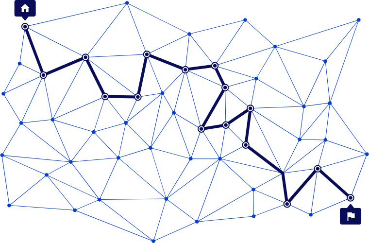

::: objetivos Repaso de conceptos de redes
- Conceptos de redes
- La red de Internet
- WWW
:::

## Qué es una red

**Una red** es <Color color="verde">un conjunto de dispositivos interconectados</Color> que pueden comunicarse entre sí.

Estos dispositivos pueden ser computadoras, servidores, impresoras, teléfonos móviles, routers, y otros dispositivos que forman parte de la infraestructura de la red.

Cada dispositivo lo podemos llamar <Color color="verde">nodo</Color>

---

### Características de una red

- <Color>Interconexión</Color>: todos los dispositivos (también llamados nodos) están conectados entre sí. La conexión puede ser cableada (red cableada) o inalámbrica (red Wi-Fi).

- <Color>Acceso a todos los nodos</Color>: desde cualquier nodo de la red, es posible comunicarse con cualquier otro nodo sin salir de la red. Esto significa que no es necesario "abandonar" la red para ir de un dispositivo a otro, garantizando que los datos viajen de un nodo a otro de manera directa o a través de otros nodos.

- <Color>Identificación única en la red</Color>: para que los dispositivos puedan comunicarse correctamente, es fundamental que cada nodo tenga una identificación única dentro de la red. Esta identificación se conoce como dirección IP (en redes basadas en IP) y actúa como un número de identificación para cada dispositivo, permitiendo que los mensajes y datos lleguen al destino correcto.

- <Color>Dirección IP</Color>: cada nodo tiene una dirección IP única, lo que permite identificarlo en la red. Por ejemplo, en una red local, las direcciones IP pueden ser de la forma 192.168.1.x, donde x identifica de manera única a cada dispositivo en la red. <Color>La dirección IP</Color> es parte del protocolo IP, conceptos que abordaremos más adelante.

---

### Implicaciones de la identificación única

Este es un concepto fundamental y necesario. El hecho de que necesariamente cada dispositivo o nodo se tenga que identificar de forma única y que se permita la interconexión total tiene unas implicaciones:

- <Color>Enrutamiento de datos</Color>: para que los datos lleguen de un nodo a otro, la red utiliza esta identificación para determinar el camino adecuado entre los dispositivos.

- <Color>Colisión de direcciones</Color>: si dos nodos tienen la misma dirección IP, puede producirse un conflicto que impida que ambos nodos funcionen correctamente en la red.

- <Color>Seguridad</Color>: la identificación única también es importante desde el punto de vista de la seguridad. Al tener control sobre qué dispositivos están en la red, es más fácil implementar políticas de seguridad y control de acceso.

::: info Ejemplo
Imagina que tienes una red de 5 computadoras en una oficina. Cada una tiene una dirección IP única. Si el dispositivo A quiere enviar un archivo al dispositivo B, lo hará utilizando la dirección IP de B. Gracias a esta identificación única, el archivo llegará directamente a B sin confusiones ni errores.
:::
