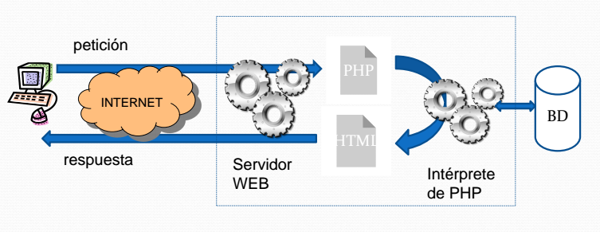
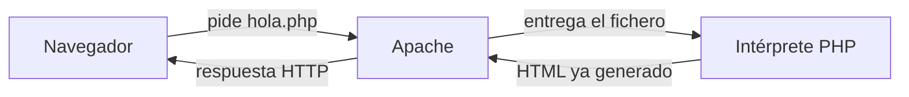

:::objetivos 
 - Contextualizar conceptos que ya hemos visto
 - Ver qué es PHP como lenguaje
 - Situar la versión con la que vamos a trabajar
:::

::: objetivos Al terminar esta página deberás…
- Explicar qué es PHP y en qué máquina se ejecuta
- Distinguir el fichero `.php` de lo que recibe el navegador
- Saber dónde consultar el manual y la versión del lenguaje
  :::

::: previo Antes de esta página
En [Introducción al desarrollo web](/01_Conceptos_generales/) vimos qué significa desarrollar y por qué en la web usamos un lenguaje interpretado. En [Motivación](/000_Presentacion/02_motivacion/) quedó dicho que PHP es interpretado, de tipado dinámico, y que su ejecución ocurre en un entorno cliente/servidor.

En este apartado vamos a desarrollar estos conceptos.
:::

## Qué es PHP

::: definicion PHP | fa-brands fa-php
**PHP** (*PHP: Hypertext Preprocessor*) es el lenguaje con el que, en este módulo, escribimos la parte de la aplicación que se ejecuta en el servidor.
:::

El nombre es un acrónimo recursivo: *PHP: Hypertext Preprocessor*. La idea que nos importa es la del nombre: el servidor **preprocesa** el documento y el cliente recibe el resultado.

Es un lenguaje de código abierto.
Es muy popular y tiene mucha madured 

* PHP nació en 1994, creado por **Rasmus Lerdorf** inicialmente para gestionar y registrar accesos a su página personal.

* Es un lenguaje muy maduro  **con más de 30 años de evolución** y un gran ecosistema  de mantenimiento. Actualmente sigue en constante evolución
* 
Actualmente, PHP sigue teniendo una enorme presencia en Internet: aproximadamente _**el 70 % de las webs cuyo lenguaje de servidor puede identificarse utilizan PHP (
<i class="fa-solid fa-globe"></i> [W3Techs - Estadísticas de uso de PHP](https://w3techs.com/technologies/details/pl-php)**_.

Esto no significa que PHP sea el lenguaje más utilizado para **nuevos proyectos**.

<i class="fa-solid fa-globe"></i> [W3Techs](https://w3techs.com/technologies/details/pl-php)
muestra que PHP sigue teniendo una enorme presencia en la web.

<i class="fa-solid fa-ranking-star"></i> [TIOBE](https://www.tiobe.com/tiobe-index/)
muestra, sin embargo, una popularidad mucho menor que lenguajes como **Python o JavaScript**.

Estas estadísticas miden aspectos diferentes y **ninguna mide directamente cuántos proyectos nuevos se crean con cada lenguaje**.


## Evolución reciente de PHP

PHP es actualmente un lenguaje **vivo y en continua evolución**.

Las últimas versiones han incorporado importantes mejoras en **rendimiento, tipado, orientación a objetos y sintaxis**.

Esto hace que PHP siga siendo una alternativa **actual e interesante para el desarrollo web del lado del servidor**, frente a otras tecnologías como **Python** o **JavaScript con Node.js**.

<i class="fa-brands fa-php"></i> [Versiones soportadas de PHP](https://www.php.net/supported-versions.php)

### PHP 5.6 y el PHP 6 que nunca llegó

- **PHP 5.6** apareció en **2014** y fue durante años una de las versiones más utilizadas de PHP.
- Durante la época de PHP 5 se comenzó a trabajar en **PHP 6**.
- PHP 6 pretendía incorporar, entre otras mejoras, un soporte mucho más profundo de **Unicode**.
- El proyecto resultó demasiado complejo y finalmente fue **abandonado**.
- Por tanto, **PHP 6 nunca llegó a publicarse oficialmente como versión estable**.
- Algunas de las mejoras desarrolladas durante aquel proyecto fueron incorporándose posteriormente a PHP 5.
- Tras PHP 5.6, la siguiente gran versión estable fue directamente **PHP 7.0**.

<i class="fa-brands fa-php"></i> [Historia oficial de PHP](https://www.php.net/manual/es/history.php.php)

---

### PHP 7 — un salto importante

- **PHP 7.0** apareció en **2015**.
- Supuso uno de los mayores cambios internos en la historia de PHP.
- Incorporó **Zend Engine 3**, una importante reescritura del motor de ejecución.
- Mejoró considerablemente el **rendimiento** y redujo el **consumo de memoria**.
- PHP 7 podía llegar a ejecutar determinadas aplicaciones **hasta dos veces más rápido que PHP 5.6**.
- El gran salto se produjo con **PHP 7.0**, no con PHP 7.3.
- **PHP 7.3 (2018)** continuó incorporando mejoras, pero utilizaba la misma generación del motor Zend.

> **PHP 7 → Zend Engine 3 → hasta ×2 de rendimiento respecto a PHP 5.6.**

<i class="fa-brands fa-php"></i> [PHP 7 y Zend Engine 3](https://www.php.net/manual/en/migration70.php)

---

### PHP 8 — modernización del lenguaje

- **PHP 8.0** apareció en **2020**.
- Incorporó **JIT (Just-In-Time Compilation)**.
- Añadió **argumentos con nombre**.
- Incorporó **atributos**.
- Añadió **Union Types**.
- Incorporó la expresión `match`.
- Añadió el operador **nullsafe `?->`**.
- Continuó reforzando el **sistema de tipos**.
- Las versiones PHP 8.x han seguido modernizando el lenguaje, especialmente en **tipado, orientación a objetos, sintaxis y rendimiento**.

<i class="fa-brands fa-php"></i> [Novedades de PHP 8.0](https://www.php.net/releases/8.0/)

---

### PHP 8.5 — versión estable actual

- **PHP 8.5** apareció el **20 de noviembre de 2025**.
- Es actualmente la rama estable más reciente de PHP.
- Incorpora el operador **pipe `|>`**.
- Incorpora una nueva extensión **URI**.
- Añade mejoras relacionadas con `clone`.
- Incorpora el atributo **`#[NoDiscard]`**.
- Continúa mejorando el **rendimiento, tipado y sintaxis** del lenguaje.

<i class="fa-brands fa-php"></i> [Novedades oficiales de PHP 8.5](https://www.php.net/releases/8.5/es.php)

---

### PHP 8.6 — próxima versión

- **PHP 8.6 todavía no es una versión estable**.
- Su lanzamiento estable está previsto para **noviembre de 2026**.
- Continúa evolucionando el lenguaje de forma incremental.
- Incorpora la función `clamp()`.
- Mejora la información proporcionada por algunos errores de **JSON**.
- Introduce mejoras relacionadas con **closures y arrow functions**.
- Continúa incorporando mejoras de **rendimiento y seguridad**.

<i class="fa-brands fa-php"></i> [PHP 8.6](https://php.watch/versions/8.6)

---

### PHP 9 — el siguiente gran salto

- **PHP 9 todavía no tiene una versión estable ni una especificación definitiva**.
- Será una oportunidad para eliminar funcionalidades que han quedado **obsoletas (`deprecated`)** durante PHP 8.x.
- Algunos comportamientos que actualmente generan avisos pasarán previsiblemente a producir **errores**.
- El objetivo general es continuar haciendo PHP un lenguaje **más estricto, consistente y moderno**.
- Las funcionalidades definitivas dependerán de las propuestas **RFC** que sean aprobadas.

> **PHP 9 continuará la modernización del lenguaje, eliminando comportamientos históricos y haciendo PHP más estricto y consistente.**

<i class="fa-solid fa-code-branch"></i> [RFC oficiales de PHP](https://wiki.php.net/rfc)

<i class="fa-solid fa-trash-can"></i> [Deprecaciones previstas para PHP 9](https://wiki.php.net/rfc/deprecations_php_8_5)

___
### Instalar y configurar PHP

PHP necesita un **intérprete** instalado en el servidor.

En nuestro entorno trabajaremos con **Apache + PHP dentro de Docker**, por lo que tendremos preparado el entorno sin necesidad de instalar PHP directamente en nuestro sistema.

PHP dispone de un fichero de configuración principal llamado `php.ini`, que permite modificar diferentes aspectos de su funcionamiento.

Algunos ejemplos son:

- Visualización de errores.
- Límites de memoria.
- Tamaño máximo de los ficheros que se pueden subir.
- Configuración de extensiones.

<i class="fa-brands fa-php"></i> [Configuración de PHP](https://www.php.net/manual/es/configuration.php)

<i class="fa-solid fa-sliders"></i> [Directivas de php.ini](https://www.php.net/manual/es/ini.list.php)

___

### Ejecución de php

::: recuerda Ejecución de php
<color>En las aplicaciones de desarrollo web</color>
1. PHP se ejectua en el <color>servidor web</color>
2. Es <color>incrustrado</color> en el HTML
3. El cliente solo ve <color>el resultad de la ejecución </color>, <color>nunca el código</color>

La imagen siguiente muestra brevemente el proceso:

> **Fuente:** Gutiérrez, A.; Bravo, I. *PHP 5.0 a través de Ejemplos*.
> Alfaomega-Ra-Ma, 2005.
:::
___

::: recuerda El servidor en acción | fa-solid fa-server

___El documento PHP, una vez interpretado correctamente en el servidor, produce una página HTML que será enviada al cliente.___

:::

::: recuerda PHP y HTML | fa-solid fa-code

El código PHP está embebido en documentos HTML.

Esto permite introducir dinamismo en las páginas web, lógicamente en el servidor.

:::

::: recuerda Apache ejecuta PHP y lo incrusta en HTML | fa-solid fa-gears

El intérprete PHP ignora el texto HTML hasta que encuentra una etiqueta de inicio de un bloque de código PHP.

Entonces interpreta las instrucciones hasta encontrar la etiqueta de cierre, generando la salida correspondiente.

Esta salida, si la hay, se incorpora al documento HTML que finalmente se entrega al cliente.

:::


<CardPane>
<Card header="Un lenguaje" color="#4F5B93">
Instrucciones, variables, funciones y estructuras de control. Programar, con la sintaxis de PHP.
</Card>
<Card header="En el servidor" color="#2496ed">
El intérprete corre junto a Apache, un servicio que tenemos dockerizado.
El cliente, solicita un recurso y recibe  _la página_, que es la  la salida fruto de, entre otras acciones, ejectuar  el fichero `.php`. El código php  se queda en el servidor.
</Card>
<Card header="Genera la respuesta" color="#4f46e5">
Cada petición ejecuta el script. Lo que vuelve por HTTP es, casi siempre, HTML.
</Card>
</CardPane>

## El fichero y lo que ve el navegador

Un programa mínimo. La sintaxis de las variables llega en el tema siguiente; aquí solo importa el reparto del trabajo.

<PhpRunner>

```php
<?php
$nombre = "Ada";
echo "<p>Hola, $nombre</p>";
```

</PhpRunner>

El servidor ejecuta esas líneas. El navegador recibe el texto que ha escrito `echo`:

:::practica Prueba las siguientes acciones
- Escribe este fichero y ejecuta el contenido de la página en el navedador

- Abre el código en el navegador y analiza el resultado

- Vuelve a repetir la acción, pero en este caso guarda el fichero con extensión html

- Evalúa y razona la salida
:::

```html
<p>Hola, Ada</p>
```

`<?php` le dice a Apache: a partir de aquí, pásaselo al intérprete. Lo que haya fuera de las etiquetas PHP se envía tal cual. Por eso un `.php` puede mezclar HTML y código.



* [Vamos a revisar el proceso de carga de una página web](https://manuel.web.infenlaces.com/02_entornos_herramientas/www/#arquitectura)
  
A partir de aquí, tienes una tarea propuesta

::: pregunta Para pensar en clase
Si abres el `.php` con el editor, ves `$nombre` y `echo`. Si abres la misma URL en el navegador y miras el código fuente de la página, ¿qué esperas encontrar?
:::

<Quiz
title="¿Dónde se ejecuta el código PHP de esta asignatura?"
:options="[
{ text: 'En el navegador de quien visita la página, igual que el JavaScript de cliente.', correct: false, why: 'El JavaScript de cliente sí corre en el navegador. PHP lo interpreta el servidor, y la respuesta sale ya generada.' },
{ text: 'En el servidor, cada vez que llega una petición a ese script.', correct: true, why: 'Apache entrega el .php al intérprete. El navegador recibe la salida, normalmente HTML.' },
{ text: 'Se compila una vez a un ejecutable y ese binario es lo que se publica.', correct: false, why: 'PHP es interpretado: editas el .php y, al recargar, el servidor lo vuelve a ejecutar. OPcache guarda bytecode para no repetir todo el análisis, y aun así publicamos el script.' }
]"
/>


### Restricciones de PHP

PHP se ejecuta **en el servidor**, por lo que trabaja principalmente con los recursos disponibles en él.

Por ejemplo:

- Puede acceder a ficheros del servidor si tiene los permisos necesarios.
- Puede acceder a bases de datos.
- Puede recibir información enviada por el navegador mediante una petición HTTP.
- **No puede acceder directamente a los ficheros del ordenador del cliente.**
- **No puede ejecutar acciones directamente en el navegador** como puede hacerlo JavaScript.

El navegador y el servidor intercambian información mediante **peticiones y respuestas HTTP**.

::: recuerda PHP se ejecuta en el servidor | fa-solid fa-server

El código PHP **permanece en el servidor**.

El navegador recibe el resultado de su ejecución, normalmente **HTML**.

:::


### Cómo escribir PHP

El código PHP se escribe entre las etiquetas:

```php
<?php

// Código PHP

?>
```

En nuestros programas utilizaremos siempre esta sintaxis:

```php
<?php
```

Cuando un fichero contiene únicamente PHP, normalmente **se omite la etiqueta de cierre `?>`**.

```php
<?php

$nombre = "Ada";

echo "Hola $nombre";
```

Los ficheros que contienen código PHP se guardan normalmente con extensión:

```text
.php
```

::: practica Nuestro primer PHP | fa-solid fa-flask

Crea un fichero llamado `info.php` y ejecuta la función `phpinfo()`.

Ejecuta el fichero desde el servidor y observa la información que PHP genera sobre su entorno y configuración.


:::

<PhpRunner>

```php
<?php

phpinfo();
```


</PhpRunner>


<i class="fa-brands fa-php"></i> [Sintaxis básica de PHP](https://www.php.net/manual/es/language.basic-syntax.php)


### ¿Dónde escribiremos nuestro código?

Al principio escribiremos pequeños programas PHP para **aprender y probar el lenguaje**.

Más adelante utilizaremos una organización mucho más estructurada.

Introduciremos el patrón **MVC (Modelo - Vista - Controlador)**, que nos ayudará a decidir **dónde debe estar cada parte del código** de una aplicación.

> Ahora nos interesa aprender PHP. Después aprenderemos a **organizar correctamente ese código**.

## Dónde mirar

::: referencias Dónde buscar información
- [Manual oficial en español](https://www.php.net/manual/es/) — tipos, funciones y ejemplos. Es la referencia.
- [php.net](https://www.php.net/) — portada, descargas y versión actual.
- [Estándares PSR](https://www.php-fig.org/psr/) — cómo se escribe y se organiza el código cuando el proyecto crece.
- [Seguridad](https://www.php.net/manual/es/security.php) — capítulo del manual. Lo usaremos con formularios y con bases de datos.
- [Wiki de PHP](https://wiki.php.net/) — propuestas de las próximas versiones. Es discusión del lenguaje, no un tutorial.
- [PHP: The Right Way](https://phptherightway.com/) — prácticas actuales. Hay un [espejo en español](http://phpdevenezuela.github.io/php-the-right-way/).
- [WikiEducator de esta introducción](https://es.wikieducator.org/index.php?curid=4321) — el apunte que esta página venía embebiendo.
  :::

::: pageinfo Si el manual y un blog no dicen lo mismo
**Manda el manual** de la versión que ejecuta el contenedor.
:::

## Qué cubre el bloque de PHP

Esta página solo sitúa el lenguaje. A lo largo del bloque vamos a hacer esto:

::: finalidad A lo largo del bloque
- Escribir scripts PHP
- Declarar y usar variables
- Generar salida
- Declarar constantes
- Usar funciones que ya trae el lenguaje, y escribir las nuestras
- Usar estructuras de control selectivas y repetitivas
- Incluir un script desde otro (`include` y `require`)
  :::

Después vendrán arrays, formularios y, más adelante, objetos y bases de datos. El orden de los temas es el camino; el objetivo es saber desarrollar la parte servidor, no recitar el índice.