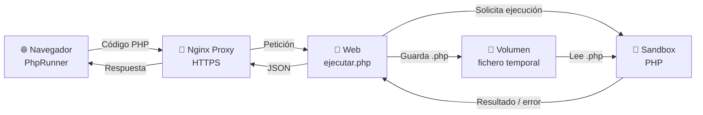

<Objetivos title="Lenguaje PHP">

- Estudiaremos una tecnología (de las muchas posibles), para desarrollar aplicaciones en el servidor
- Siempre estudiamos desarrollo web
- Qué es PHP
- Ver versiones
- Referencias

</Objetivos>


:::objetivos  Lenguaje PHP

- Estudiaremos una tecnología (de las muchas posibles), para desarrollar aplicaciones en el servidor
- Siempre estudiamos desarrollo web
- Qué es PHP
- Ver versiones
- Referencias

:::

# Visualizando ejemplos

A lo largo de estos apuntes encontrarás ejemplos de código PHP que puedes **modificar y ejecutar directamente desde la página**.

Por ejemplo, una variable permite almacenar un valor:

<PhpRunner>

```php
<?php
$nombre = 'Manuel';
echo "Hola $nombre";
?>
```

</PhpRunner>

Puedes modificar el código anterior y pulsar **Ejecutar** para comprobar inmediatamente el resultado.

Si quieres volver al ejemplo original, utiliza el botón **Restaurar**.

::: info Ejecución real de PHP
El código que escribes **no se simula en el navegador**.

Cuando pulsas **Ejecutar**, el código PHP se envía a un servidor, donde se ejecuta utilizando un **intérprete PHP real**.

El resultado de esa ejecución se devuelve al navegador y se muestra en el apartado **Salida**.

Esto permite experimentar con PHP de una forma muy similar a como se ejecutaría un fichero `.php` en un servidor.
:::

## ¿Cómo funciona?

Para ejecutar los ejemplos de forma controlada se utilizan varios contenedores Docker con responsabilidades diferentes.



De forma simplificada intervienen **tres contenedores principales**:

1. **Nginx Proxy**  
   Recibe las peticiones HTTPS realizadas desde los apuntes y las dirige al servicio correspondiente.

2. **Web**  
   Recibe el código enviado por `PhpRunner`, realiza las comprobaciones necesarias y crea un fichero PHP temporal.

3. **Sandbox**  
   Ejecuta el fichero utilizando un intérprete PHP real y devuelve el resultado de la ejecución.

El contenedor **Web** y el **Sandbox** comparten un volumen Docker que permite que el sandbox pueda leer el fichero PHP temporal generado para cada ejecución.

::: info Importante
El navegador **nunca ejecuta directamente PHP**.

PHP es un lenguaje que se ejecuta en el servidor. `PhpRunner` envía el código al servidor y posteriormente muestra en el navegador el resultado recibido.
:::

## Un entorno deliberadamente limitado

::: warning Entorno de prácticas
Este componente está diseñado para **aprender y probar pequeños fragmentos de PHP**, no para ejecutar cualquier programa PHP.

Por motivos de seguridad, la ejecución está limitada.

Determinadas funciones y operaciones pueden estar deshabilitadas y existen límites de tiempo, memoria, procesos y tamaño del código.

Por tanto, un programa PHP que funciona en un servidor convencional podría no estar permitido en este entorno.
:::

Estas restricciones son especialmente importantes porque el código introducido en el editor es **código proporcionado por el usuario que se ejecutará realmente en un servidor**.

El contenedor encargado de ejecutarlo funciona como un **sandbox** (entorno aislado), con permisos y recursos restringidos.

De esta forma podemos practicar de forma controlada con:

- variables y tipos de datos;
- operadores y expresiones;
- estructuras de control;
- bucles;
- funciones;
- arrays;
- objetos;
- y otros elementos del lenguaje PHP.

::: tip Objetivo
`PhpRunner` no pretende sustituir un entorno completo de desarrollo PHP.

Su objetivo es permitir **modificar un ejemplo, experimentar con él y observar inmediatamente qué ocurre** mientras estudiamos los diferentes conceptos del lenguaje.
:::