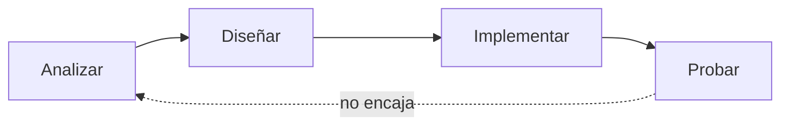

# Introducción

<objetivos title="Qué desmontamos hoy">
- El nombre del módulo, por piezas
- Qué es desarrollar una aplicación
- Analizar → diseñar → implementar
- Compilación vs interpretación
</objetivos>

---

## El objetivo lo dice el nombre

**Desarrollo de aplicaciones web en entorno servidor**

En esta introducción no programamos todavía.

Desgranamos esa frase.

---

## Tres partes

1. **Desarrollar** una aplicación
2. **Aplicaciones web**
3. **Entorno servidor**

---

## ¿Qué es desarrollar?

Muchas respuestas posibles.

En clase debería salir al menos una que se pueda defender.

---

## Actividad

Intenta una definición de **desarrollar una aplicación**.

Dos o tres frases. Luego la contrastamos.

---

## Definición

Dado un **problema de naturaleza lógica**:

- **Implementar** un programa
- con un **lenguaje de programación**
- un conjunto de **instrucciones**
- en un **entorno computacional**
- que **solucionan** el problema de forma automatizada

---

## No es “ponerse a picar”

1. **Entender** muy bien lo que queremos hacer
2. **Planificarlo**
3. **Realizarlo** y **probarlo**

---

## Mitos del desarrollo

Los atajos se pagan más adelante.

---

## Entender el problema sigue primero

Una IA puede ayudar a redactar, a probar, a traducir a sintaxis.

**No entiende el problema por ti.**

Si el enunciado está mal leído, el código también.

---

## Implementar es tres gestos

1. **Analizar** el problema
2. **Diseñar** una solución algorítmica
3. **Escribir el código** (interpretado o compilado)

---

## El esquema

---

## Fases tradicionales

---

## Actividad

Aplicación **ecuaciones de segundo grado**

con este mismo esquema.

---

## El planteamiento

- Encontrar los valores de *x* que satisfacen la ecuación
- Nos dan la fórmula a aplicar
- Eso ya es análisis: **entender el problema del cliente**

---

## El enunciado

---

## Un posible análisis

---

## Un posible diseño

---

## Implementación

Transcribir el diseño a un lenguaje concreto, con su sintaxis.

Más adelante: PHP. El esquema no cambia.

---

## ¿Compilación o interpretación?

Las instrucciones tienen que acabar en código máquina.

Pueden **compilarse** o **interpretarse**.

---

## Pregunta

¿Java es compilado o interpretado?

---

## En la web, ¿qué modelo?

- ¿Compilado, porque es más rápido?
- ¿Interpretado, porque se adapta a más máquinas?

---

## Lo que nos interesa en DAWS

PHP es **interpretado**: editas, recargas, el servidor ejecuta.

PHP 8 + OPcache: no es el PHP de 2005.

En este módulo: PHP detrás de Apache, casi siempre en Docker.

---

## Una aplicación web

No todos los programas son iguales.

Escritorio, tiempo real, juegos… y **aplicaciones web**.

En la web el servidor **no espera** a que teclees: recibe la solicitud **con los datos** y responde.

---

## Sigue en conceptos web

Cliente, servidor, URI y `curl`:

**Aplicación web** (bloque 3)

Y después: **qué es PHP**.
