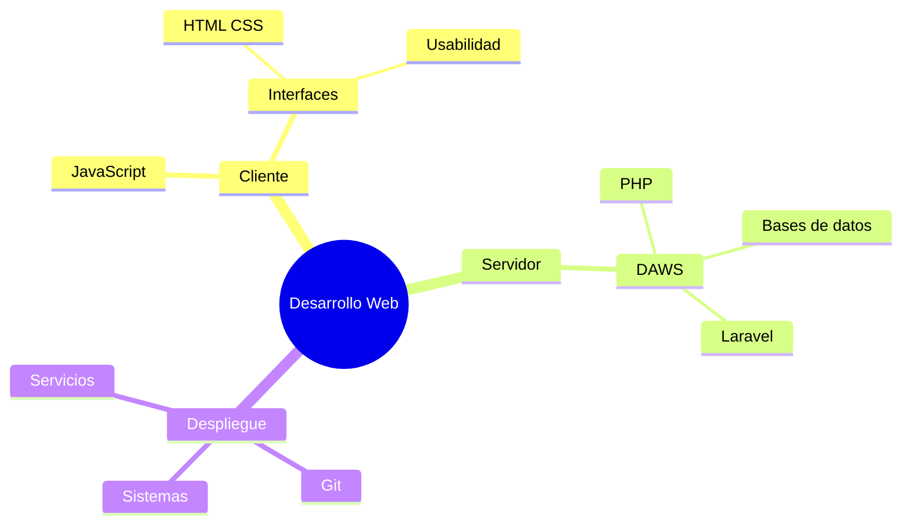

---
title: Presentación del curso
---

# Presentación de DAWS

<objetivos title="El módulo DAWS">
- Entender el escenario cliente / servidor
- Programar en PHP con criterio
- Montar el entorno con Docker y no perder el trabajo con Git
- Desarrollar aplicaciones profesionales usando Laravel como framework
</objetivos>

---

## Cómo miramos el módulo

- Ver y comprender los principios básicos teóricos
- Adaptarnos a las tecnologías actuales
- Desarrollar la capacidad de **aprender a aprender**
- Desmitificar que una tecnología nueva es “empezar de cero”
- La mejor tecnología es la que resuelve el problema **y** con la que te sientes cómoda

---

## DAWS dentro del ciclo

- **Cliente:** programación web en cliente · 180 h
- **Interfaces:** diseño de interfaces web · 180 h
- **Servidor:** DAWS · 190 h
- **Despliegue:** 90 h

---

## Desarrollar una aplicación web

::: warning
- Desarrollar una aplicación → **saber programar**
- Una aplicación → **web**
- Y finalmente → **desplegarla en un servidor**
:::

---

## Un proyecto común

*Todos con el mismo objetivo*

El planteamiento es que somos un grupo trabajando en un proyecto.

---

## Objetivo

**Aprender a aprender**

Conocer cómo son las tecnologías de desarrollo web.

**Saber desarrollar una aplicación web**

No se trata solo de manejar herramientas.

Se trata de **programar y formar parte de un desarrollo**.

---

## Horario del curso

---

## Evaluación y exámenes

Cada bloque: **al menos un trabajo o práctica** obligatorio.

Puede ser **nota** o **apto / no apto**.

---

## Nota de cada trabajo

1. Nota del trabajo o práctica
2. En el examen, **una pregunta sobre ese trabajo** (de 0 a 1)
3. Nota final del trabajo = **las dos multiplicadas**

---

## Puntos clave

**Nota final por evaluación**

- **0,4** de trabajos + **0,6** de exámenes
- La nota final del curso: **media aritmética** de cada evaluación

---

## Puntos clave

**Convocatorias**

- Las evaluaciones **aprobadas se guardan** (1.ª y 2.ª), según proceda
- En la **convocatoria final no hay que presentar trabajos**

---

## Desarrollo Web

---

## Distribución por temas

No necesariamente se impartirán en este orden.

Tampoco tienen la misma duración.

---

## Bloque introducción

- **Tema 0.** Presentación
- **Tema 0.** Motivación
- **Tema 1.** Conceptos generales del desarrollo web
- **Tema 2.** Arquitecturas y tecnologías web
- **Tema 3.** Instalación del sistema y puesta en marcha

---

## PHP en el servidor

- **Tema 4.** Sintaxis y formularios
- **Tema 5.** PHP orientado a objetos
- **Tema 6.** Arrays
- **Tema 7.** Ficheros en el servidor
- **Tema 8.** Autenticación, sesiones y cookies

---

## Bases de datos y utilidades

- **Tema 9.** Dockerizando el entorno
- **Tema 10.** MySQLi y PDO
- **Tema 11.** MongoDB

---

## Segunda evaluación

A partir de aquí: **segunda evaluación**.

---

## PHP: librerías

- **Tema 12.** Utilidades y librerías
  - Composer (PSR-4 y classmap)
  - Plantillas
  - Ajax (Jaxon)
  - PDF (FPDF)
  - PayPal
- Práctica de la tienda

---

## PHP: temas avanzados

- **Tema 13.** REST, SOAP y GraphQL
- **Tema 14.** Aplicaciones híbridas: Ajax y Google

---

## Laravel

- **Tema 14.** Instalación y funcionamiento
- **Tema 15.** Rutas, vistas y controladores
- **Tema 16.** Eloquent
- **Tema 17.** Una aplicación con Laravel
- **Tema 18.** Alrededor de la aplicación
  - Tests · Inertia · Filament
  - APIs / servicios web · Sentry

---

## Python y Django

- **Tema 20.** Python en la web
- **Tema 21.** Django

---

## Gestores de contenidos

- **Tema 22.** Drupal y PHP

---

# Contacto

**Manuel Romero Miguel**

Profesor del módulo de servidor